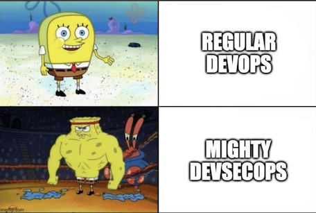

Source:
- https://daringfireball.net/
- https://github.com/adam-p/markdown-here/wiki/Markdown-Cheatsheet
- https://towardsdatascience.com/the-ultimate-markdown-cheat-sheet-3d3976b31a0
- https://github.github.com/gfm/#introduction :octocat:
- https://www.w3schools.com/tags/

## Headers

# H1
## H2
### H3
#### H4
##### H5
###### H6

HTML-styled headers

<h1>HTML-styled header H1</h1>
<h3>HTML-styled header H3</h3>

Alternatively styled headers (works only for H1 and H2, requires any number of `==` or `--` underneath header name)

Alternatively-styled Heading 1
==

Alternatively-styled Heading 2
--

### Heading IDs

###### My Great Heading

<h6 id="html-heading-id">My Great HTML-styled Heading</h3>

Linking to Heading IDs:
- [Link to my great heading](#my-great-heading)
- <a href="#html-heading-id">Link to my great HTML-styled heading</a>
- [Link to other website's heading](https://www.markdownguide.org/extended-syntax#heading-ids)


## Line Breaks

Here's a line to start with.

This line is separated from the one above by **two newlines**, so it will be a **separate paragraph**. Adding more than two newlines **will not** result with additional space between paragraphs.

This line is also a separate paragraph, but...
This line is only separated by a single newline, so it's a separate line in the *same paragraph*.
To have a line break without a paragraph, **previous line** needs to use **two trailing spaces**.

`&nbsp;` - 1 space<br>
`&ensp;` - 2 spaces<br>
`&emsp;` - 3 spaces<br>

`<br>` - HTML-styled line brake - equivalent to two newlines.


## Text manipulation

Italics (emphasis) are made with *asterisks* or _underscores_.

Bold (strong emphasis) is made with **double asterisks** or __double underscores__.

Combined emphasis is made with **_asterisks and underscores_** or ***triple asterisks***.

~~Strikethrough~~ is made with tildes.

<samp>Monospaced text.</samp>

<ins>Underlined text.</ins>

<table><tr><td>Boxed text.</td></tr></table>

Normal and <sub>subscripted text.</sub>

Normal and <sup>superscripted text.</sup>

```
<!--
Commented out text.
-->
```

@person_mentioning

#prs_or_issues_mentioning

:exclamation: Exclamation sign. :question: Question sign. :warning: Warning sign.

[Emoji's list](https://github.com/ikatyang/emoji-cheat-sheet/blob/master/README.md "Emoji's list")


## Code and Syntax Highlighting

**Inline code** has single back-ticks around it - (`).

**Code blocks** can be created by indenting lines by **four spaces** or **one tab**.

**Fenced code blocks** (```) allow the same with disregard to indenting and additionally supports **syntax highlighting**:

```javascript
var s = "JavaScript syntax highlighting";
alert(s);
```

```
No language indicated, so no syntax highlighting.
But let's throw in a <b>tag</b>.
```

To display triple backticks in a fenced code block, wrap them inside quadruple backticks. :octocat:
````
```
Look! You can see my backticks.
```
````


## Blackquotes

> This is a single line of blackquote.
> This is a newline of blackquote - it will be part of the same blackquote.

> This is a newline of blacqoute separated from previous with empty line.

> This is a first line of multiline blacqoute.
>
> This is a third line of of multiline blacqoute. Middle line only has `>` sign. Hey it also **supports** _markdown_.
> - Like nested lists for example.

> This is a first line of multiline **nested** blacqoute.
>> This is first nested line.
>>> #### This is second nested line marked as header. It can go on and on.


## Lists

1. Ordered
2. List
---
1. Ordered
    1. List
        - With
            - Sub-item
2. First level
    1. Second level
---
- Unordered
    - List
        - With
            - Sub-item
- First level
    - Second level
---
* Unordered list can use asterisks
- Or minuses
+ Or pluses


### Task lists:
- [x] Write the press release
- [ ] Update the website


<!-- ##### Definition lists:

First Term
: This is the definition of the first term.

Second Term
: This is one definition of the second term.
: This is another definition of the second term. -->


## Links

**[Inline-styled link with strong emphasis](http://www.google.com)**

[Inline-styled link with title](http://www.google.com "Google's Homepage")

[Reference-styled link][Arbitrary case-insensitive reference text]

[Numbered reference-styled link][1]

Link referenced [elswhere].

URLs (http://www.google.com) and URLs in angle brackets <http://www.google.com> `<>` will automatically get turned into links.

URLs can be disabled by adding `<span>` HTML tag into it - www<span>.google.pl

[arbitrary case-insensitive reference text]: https://www.mozilla.org
[1]: https://pl.wikipedia.org/wiki/Markdown "Markdown"
[elswhere]: https://pl.wikipedia.org/wiki/Linux

### Relative links

[Link to a file on the same branch][/assets/images/electrocat.png]

[Link to a file on another branch][/../main/assets/images/electrocat.png]

[Link to a file in issues, pull requests and comments of the repository][../blob/main/assets/images/electrocat.png]

[Link to a file in another repository][/../../../../github/docs/blob/main/assets/images/electrocat.png]

[Link to a file in issues, pull requests and comments of another repository][../../../github/docs/blob/main/assets/images/electrocat.png?raw=true]


## Images

Inline-styled image:


Reference-styled image:
![alt text][image]

[image]: https://github.com/adam-p/markdown-here/raw/master/src/common/images/icon48.png "Image title text 2"

HTML-styled image:
<a name="Image title text 3"></a>
<!-- border tag not working in GitHub! -->

HTML-styled image with reference:
<a href="https://towardsdatascience.com/the-ultimate-markdown-cheat-sheet-3d3976b31a0"></a>
<!-- alt tex tag not working! -->

HTML-styled image with relative reference:


HTML-styled image with markdown reference:
[][markdown]
<!-- alt tex tag not working! -->
[markdown]: https://towardsdatascience.com/the-ultimate-markdown-cheat-sheet-3d3976b31a0

HTML options for image inserting:
- href="link"
- width="INT" or "INTpx"
- height="INT" or "INTpx"
- border="INT"


## Alignments

Text or image alignments can be done using HTML tags.

Image alignment:
<p align="right">
  
</p>

Text alignment:
<h5 align="center">Centered text.</h5>


## Tables

Markdown-styled tables with headers and different pipes/dashes alignment

| Default | Left align | Center align | Right align |
| - | :- | :-: | -: |
| 9999999999 | 9999999999 | 9999999999 | 9999999999 |
| _9999999_ | 9999999 | 9999999 | 9999999 |

| Default    | Left align | Center align      | Right align |
| ---------- | :--------- | :----------:      | ----------: |
| 9999999999 | 9999999999 | 9999999999        | 9999999999  |
| 9999999    | 9999999    | http://google.com | 9999999     |

Default    | Left align | Center align | Right align
---------- | :--------- | :----------: | ----------:
9999999999 | 9999999999 | 9999999999   | 9999999999
9999999    | 9999999    | 9999999      | `9999999`

Markdown-styled table rules:
-  dashes `-` create each column’s header
-  pipes `|` separate each column
- any number of dashes and spaces can be used to increase readability
- text alignment is done by adding a colon `:` to the left, right, or on both side of the dashes within the header row
- outer pipes `|` are optional
- lines don't need to be fixed up prettily, inline-styled lines are also accepted
- markdown formattin is acceptable - links, code (words or phrases in backticks (`) only, not code blocks), and emphasis
- HTML character code (&#124;) to display a pipe character in a table or escapi it using `\`

HTML-styled table with no headers

<table>
  <tr>
    <td width="25%">
      Cell with fixed width of 25%
    </td>
    <td width="50%">
      Cell with fixed width of 50%
    </td>
    <td width="25%">
      Cell with fixed width of 25%
    </td>
  </tr>
</table>

HTML-styled tables side by side with headers

<table>
  <tr>
    <th>Heading 1</th>
    <th>Heading 2</th>
  </tr>
  <tr>
    <td>

| A | B | C |
|--|--|--|
| 1 | 2 | 3 |

</td><td>

| A | B | C |
|--|--|--|
| 1 | 2 | 3 |

</td></tr></table>

HTML-styled multiline table

| A | B | C |
|---|---|---|
| 1 | 2 | 3 <br/> 4 <br/> 5 |


## Footnotes

Here's a simple footnote,[^1] and here's a longer one.[^multiline_footnote]

[^1]: First footnote.
[^multiline_footnote]: Footnote with multiple paragraphs and code.

  Paragraphs need to be indented (**4 spaces** in Markdown and **2 spaces** in GitHub :octocat:) to be included in multiline footnote.

  `{ my code }`

  Another **paragraph**.


## Horizontal Rules

To create a horizontal rule, use three or more asterisks `***`, dashes `---`, or underscores `___` on a line by themselves - for compatibility, put blank lines before and after horizontal rules, otherwise it can be treated as heading.

---

Dashes

***

Asterisks

___

Underscores
