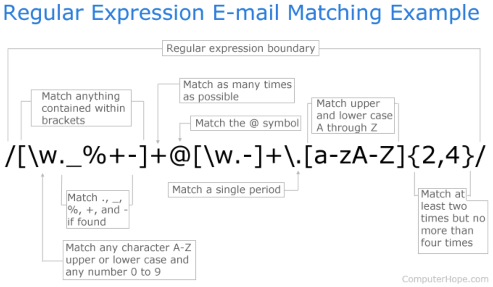

Source:
- https://www.regular-expressions.info/
- https://daringfireball.net/projects/markdown/
- Learning Regular Expressions 1st Edition; Addison-Wesley Professional
---

# Table of contents

- [Overview](#paragraph1)
- [Pattern matching mechanisms](#paragraph2)
  - [Literal match](#paragraph2.1)
  - [Metacharacters](#paragraph2.2)
    - [White signs metacharacters](#paragraph2.2.1)
    - [Metacharacter escaping](#paragraph2.2.2)
  - [Dot](#paragraph2.3)
  - [Character class](#paragraph2.4)
  - [Character range](#paragraph2.5)
  - [Negated character class/range](#paragraph2.6)
  - [POSIX standard](#paragraph2.7)
- [Quantifiers](#paragraph3)
  - [Intervals](#paragraph3.1)
  - [Overmatching](#paragraph3.2)
- [Location matching mechanisms](#paragraph4)
  - [Anchors](#paragraph4.1)
  - [Word boundaries](#paragraph4.2)
- [Grouping](#paragraph5)
  - [Nested grouping](#paragraph5.1)
- [Lookahead & lookbehind](#paragraph6)
  - [Negated lookahead & lookbehind](#paragraph6.1)
- [Conditionals](#paragraph7)
- [Examples](#paragraph8)

# Overview 

> Some people, when confronted with a problem, think "I know, I'll use regular expressions." Now they have two problems. 
> \- Jamie Zawinski, August 12, 1997

 

Regular expression (RegEx for short) is a sequence of characters that define a search pattern, which is usually used by text searching algorithms for ***find*** or ***find and replace*** operations on texts, as well as in input validation. The power of regular expressions comes from its use of metacharacters, which are special characters (or sequences of characters) used to represent something else.

 

# Pattern matching mechanisms 

By default the first match in finding mode is returned. This can be overwritten using the `/pattern/g` (**g** for global) modifier to return all matches. Most commonly used delimiters (`[` and `]`) are conventional and can be replaced with `~`, `#`, `@`, `;`, `%` or `` ` ``. If many used **all specified matching patterns must be met** for complete pattern return.

<!-- TODO: m modifier: multi line. Causes ^ and $ to match the begin/end of each -->
<!-- i modifier: insensitive. Case insensitive match (ignores case of [a-zA-Z]) -->
<!-- x modifier: Allow comments and white space in pattern -->

## Literal match 

Literal match is the simplest form of regular expression.

<table>
  <tr>
    <td>RegEx:</td>
    <td>/code/</td>
  </tr>
  <tr>
    <td>Text:</td>
    <td>My original <code><u>code</u></code> was saved in the file code1.js and the updated version is in codeFinal.js.</td>
  </tr>
</table>

> :warning: Since `g` modifier (or regex flag) wasn't used only the first match of search pattern has been returned.

 

<table>
  <tr>
    <td>RegEx:</td>
    <td>/code/g</td>
  </tr>
  <tr>
    <td>Text:</td>
    <td>My original <code><u>code</u></code> was saved in the file  <code><u>code</u></code>1.js and the updated version is in  <code><u>code</u></code>Final.js.</td>
  </tr>
</table>

> :warning: With `g` modifier all matches of search pattern have been returned.

## Metacharacters 

Metacharacters are digits with special meaning not the sign itself (literal meaning) - `\` `^` `$` `.` `*` `[`  and `]`. Two types of metacharacters can be distinguished:
- ones matching text - i.e  `.` or `*`
- ones used as a part of RegEx syntax - i.e. `[ ]` or `{ }`

<table>
  <tr>
    <td>RegEx:</td>
    <td>/1 \+ 3 \* \(2 \+ 2\)/g</td>
  </tr>
  <tr>
    <td>Text:</td>
    <td>Please see this math exercise: <code><u>1 + 3 * (2 + 2)</u></code>.</td>
  </tr>
</table>

### White signs metacharacters 

`\b` - backspace 
`\f` - form feed when encountered in code, causes printers to automatically advance one full page or the start of the next page 
`\n` - newline feed represents the end of a line of text and the beginning of a new line 
`\r` - carriage return 
`\t` - tabulator is usually the equivalent number of five or eight spaces, depending on the program 
`\v` - vertical tab

<table>
  <tr>
    <td>RegEx:</td>
    <td>/\n\n/</td>
  </tr>
  <tr>
    <td>Text:</td>
    <td>Line one. 
        <code><u> </u></code> 
        Line three. 
        Line four.</td>
  </tr>
</table>

> :bulb: In Windows environment it would be best to use - RegEx:/\r\n\r\n/g since carriage return (`\r`) is used to mark end of line.

 

`[\f\n\r\t\v]` - can be replaced with `\s` matching **any whitespace character** 
`[^\f\n\r\t\v]` can be replaced with `\S` matching **any non-whitespace character**

> :exclamation: `\b` is not included in `\s` nor `\S`.

### Metacharacter escaping 

To escape metacharacters they must be preceded with a backslash. Backslash itself must be preceded with another backslash.

| Metacharacter | Escaped Metacharacter |
| :-: | :-:  |
| `\` | `\\` |
| `^` | `\^` |
| `$` | `\$` |
| `.` | `\.` |
| `*` | `\*` |
| `[` | `\[` |
| `]` | `\]` |

## Dot `.` 

`.` is one of the most commonly used metacharacters respresenting any single character (except line breakers/newline sign).

<table>
  <tr>
    <td>RegEx:</td>
    <td>/code./g</td>
  </tr>
  <tr>
    <td>Text:</td>
    <td>My original code was saved in the file <code><u>code1</u></code>.js and the updated version is in <code><u>codeF</u></code>inal.js.</td>
  </tr>
  <tr>
    <td>Explanation:</td>
    <td>This syntax will match any word <b>code</b> followed by <b>any single character</b>.</td>
  </tr>
</table>

> :warning: Since `g` modifier (alternatively called regex flag) has beeen used all matches of `code.` were returned.

## Character class 

A character class is an explicit list of the characters that may qualify for a match in a search. A character class is indicated by enclosing a class of characters in brackets (`[` and `]`). Anything enclosed with `[` and `]` is a part of the class, meaning **any** (and only one at a time) **of the class characters must match**.

> :bulb: Metacharacters placed in character class are treated as literals therefore don't need to be escaped, however doing so is considered a good habit, e.g. /[XYZ\.\*]/.

<table>
  <tr>
    <td>RegEx:</td>
    <td>/[XYZ]code\.js/g</td>
  </tr>
  <tr>
    <td>Text:</td>
    <td>I have few JS files named <code><u>Xcode.js</u></code>, <code><u>Ycode.js</u></code> and <code><u>Zcode.js</u></code> but I don’t have the file file named Wcode.js or g<code><u>Xcode.js</u></code>.</td>
  </tr>
  <tr>
    <td>Explanation:</td>
    <td><code>(...) Wcode.js (...)</code> part wasn’t matched because not all conditions of regex were met - <code>W</code> isn’t a part of <code>[XYZ]</code>.  <code>(...) gXcode.js.</code> is an example when RegEx pattern should be more specific so that it would match pattern only when it's not a part of a string.</td>
  </tr>
</table>

<table>
  <tr>
    <td>RegEx:</td>
    <td>/[Cc]ode\.js/g</td>
  </tr>
  <tr>
    <td>Text:</td>
    <td>There are two files, <code><u>Code.js</u></code> and <code><u>code.js</u></code>.</td>
  </tr>
</table>

 

Other very rarely used character classes can match the following:
- hexadecimal digit like `\xOA` can be searched using - `\O`
- octal digit like `\011` can be searched using - `\z`
- control class like `\cZ` equal to `Ctrl+Z` can be searched using - `\c`

> :bulb: Order of characters within class has no meaning, therefore following syntax - <code><u>/[\w\\.]@com/</u></code> will match <code><u>x.y.z@com</u></code>, <code><u>123@com</u></code> or <code><u>a@com</u></code> and could be also written as <code><u>/[\\.\w]@com/</u></code>.

## Character range 

Range of characters **within a class** can be defined using dash (`-`) between two values. Following class `[0123456789]` can be simplified to `[0-9]`. Similarly defining non-numbers, i.e. `[ABCDEFGHIJKLMNOPQRSTUVWXYZ]` can be simplified to `[A-Z]` improving class visibility significantly. Same applies to lower case letters. Reverse ranges such as `[Z-A]` or `[5-1]` are not accepted. Dash (`-`) becomes a metacharacter only when used in a class (i.e. `[x-z]`), otherwise it is interpreted as a literal.

<table>
  <tr>
    <td>RegEx:</td>
    <td>[A-Za-z0-9]\.js/g</td>
  </tr>
  <tr>
    <td>Text:</td>
    <td>There are three files, <code><u>a.js</u></code>, <code><u>B.js</u></code> and <code><u>5.js</u></code>.</td>
  </tr>
</table>

 

| Character range        | Shorthand | Description
| :-                     | :-:       | :-
| `[0-9]`                | `[\d]`    | matches <b>any number
| `[^0-9]` or `[a-zA-z]` | `[\D]`    | matches <b>any sign different from numbers
| `[a-zA-z]`             | `[\w]`    | matches <b>any alphanumeric sign</b> and <b>underscore</b>
| `[^0-9a-zA-Z_]`        | `[\W]`    | matches <b>any non-alphanumeric sign</b> and <b>underscore</b>

> :warning: `[A-z]` would match all signes from `A` to `z`, but it is tricky to use this range since it also icludes signs like `^` or `[` that happen to be located between in ASCII table.

 

<table>
  <tr>
    <td>RegEx:</td>
    <td>/\d\.js/g</td>
  </tr>
  <tr>
    <td>Text:</td>
    <td>There are three files, a.js, B.js and <code><u>5.js</u></code>.</td>
  </tr>
</table>

<table>
  <tr>
    <td>RegEx:</td>
    <td>/\D\.js/g</td>
  </tr>
  <tr>
    <td>Text:</td>
    <td>There are three files, <code><u>a.js</u></code>, <code><u>B.js</u></code> and 5.js.</td>
  </tr>
</table>

## Negated character class/range 

Placing caret (`^`) metacharacter after the opening square bracket of a character class can be used to deny all multiple character classes/ranges at once.

<table>
  <tr>
    <td>RegEx:</td>
    <td>/[^0-9]/g or /\d/g</td>
  </tr>
  <tr>
    <td>Text:</td>
    <td><code><u>Today is </u></code>2018<code><u>, I am </u></code>20<u><code> years old.</u></code></td>
  </tr>
</table>

<table>
  <tr>
    <td>RegEx:</td>
    <td>/[^0-9^A-Z]/g</td>
  </tr>
  <tr>
    <td>Text:</td>
    <td>T<code><u>oday is </u></code>2018<code><u>, </u></code>I<code><u> am </u></code>20<u><code> years old.</u></code></td>
  </tr>
</table>

## POSIX standard  

POSIX standard provides simplification in defining character classes or categories of characters for variety of platform supporting RegEx implementation.

| POSIX        | ASCII                                      | Shorthand | Description
| :---         | :---                                       | :---:     | :---
| `[:alnum:]`  | `[A-Za-z0-9]`                              |           | digits, upper and lowercase letters (alphanumeric)
| `[:alpha:]`  | `[A-Za-z]`                                 |           | upper and lowercase letters
| `[:blank:]`  | `[ \t]` 	                                  | `\h`      | space and tab characters only
| `[:cntrl:]`  |  `[\x00-\x1F\x7F]`                         |           | control characters
| `[:digit:]`  | `[0-9]` 	                                  | `\d`      | digits
| `[:graph:]`  | `[\x21-\x7E]`                              |           | visible characters (anything except spaces and control characters)
| `[:lower:]`  | `[a-z]`	                                  | `\l`      | lowercase letters
| `[:print:]`  | `[\x20-\x7E]`                              |           | graphic characters and space
| `[:punct:]`  | `[!"\#$%&'()*+,\-./:;<=>?@\[\\\]^_‘{\|}~]` |           | punctuation (all graphic characters except letters and digits)
| `[:space:]`  | `[ \t\n\r\f\v]`                            | `\s`      | whitespace characters (including space)
| `[:upper:]`  | `[A-Z]`	                                  | `\u`      | uppercase letters
| `[:xdigit:]` | `[0-9A-Fa-f]`                              |           | hexadecimal digits
| `[:word:] `  | `[A-Za-z0-9_]`                             | `\w`      | alphanumeric characters with underscore character

# Quantifiers 

Quantifiers allow to declare quantities of data as part of pattern. For instance, ability to match exactly six spaces, or locate every numeric string that is between four and eight digits in length.

`?` - matches `0` or `1` of the preceding character or class

<table>
  <tr>
    <td>RegEx:</td>
    <td>/br?eak/g</td>
  </tr>
  <tr>
    <td>Text:</td>
    <td><code><u>break</u></code> and <code><u>beak</u></code></td>
  </tr>
</table>

<table>
  <tr>
    <td>RegEx:</td>
    <td>/Jan(uary)?/g</td>
  </tr>
  <tr>
    <td>Text:</td>
    <td><code><u>Jan</u></code> and <code><u>January</u></code></td>
  </tr>
</table>

<table>
  <tr>
    <td>RegEx:</td>
    <td>/Jan(uary)? 5(th)?/g</td>
  </tr>
  <tr>
    <td>Text:</td>
    <td><code><u>Jan 5th</u></code> and <code><u>Jan 5</u></code> and <code><u>January 5th</u></code> and <code><u>January 5</u></code></td>
  </tr>
</table>

 

`*` - matches `0` or more instances of the preceding character or class

<table>
  <tr>
    <td>RegEx:</td>
    <td>/abc[0-9]*/g</td>
  </tr>
  <tr>
    <td>Text:</td>
    <td><code><u>abc</u></code></td>
  </tr>
  <tr>
    <td>Text:</td>
    <td><code><u>abc123</u></code></td>
  </tr>
</table>

 

`+` - matches `1` or more instances of the preceding character or class

<table>
  <tr>
    <td>RegEx:</td>
    <td>/[0-9]+/g</td>
  </tr>
  <tr>
    <td>Text:</td>
    <td><code><u>123</u></code>abc<code><u>456</u></code></td>
  </tr>
  <tr>
    <td>Text:</td>
    <td>aa<code><u>1234</u></code>bb</td>
  </tr>
</table>

## Intervals 

Intervals are specified between `{` and `}` metacharacters. They can take either one argument for **exact interval matching** `{n}`, or two arguments for **range interval matching** `{min, max}` for multiplying search pattern that preceds them. If the comma is present but max is omitted, the maximum number of matches is **infinite** and the minimum number of matches is **at least min**.

`?` quantifier metacharacter is equivalent to `{0,1}` 
`+` quantifier metacharacter is equivalent to `{1,}`

<table>
  <tr>
    <td>RegEx:</td>
    <td>/\d{1,2}[-\/]\d{1,2}[-\/]\d{2,4}/g</td>
  </tr>
  <tr>
    <td>Text:</td>
    <td><code><u>4/8/17</u></code> 
        <code><u>10-6-2018</u></code> 
        2/2/2</td>
  </tr>
  <tr>
    <td>Explanation:</td>
    <td>Third date hasn't been matched due to not all search patterns being met - year denotation mus have at least 2 digits. Additionaly this RegEx could be simplified using grouping combined with exact interval matching - <code>/(\d{1,2}[-\/]){2}\d{2,4}/g.</code></td>
  </tr>
</table>

## Overmatching 

`+` and `*` metacharacters are **greedy** and by default will try to match maximum they can.

<table>
  <tr>
    <td>RegEx:</td>
    <td>/-[Bb]-.*-[Bb]-/g</td>
  </tr>
  <tr>
    <td>Text:</td>
    <td><code><u>-First- and -Second-</u></code></td>
  </tr>
</table>

**Lazy** matching on the other hand tries to match the minimum it can.

<table>
  <tr>
    <td>RegEx:</td>
    <td>/-[Bb]-.*?-[Bb]-/g</td>
  </tr>
  <tr>
    <td>Text:</td>
    <td><code><u>-First-</u></code> and <code><u>-Second-</u></code></td>
  </tr>
</table>

 

| Greedy | Lazy    |
|  :-:   | :-:     |
| `*`    | `*?`    |
| `+`    | `+?`    |
| `?`    | `??`    |
| `{n,}` | `{n,}?` |

## Location matching mechanisms 

Anchors and boundaries allow to describe text in terms of where it's located. They do not match any character at all. Instead, they match a position before, after, or between characters.

## Anchors 

Anchors specify **an exact position and this position only**, in the string or text where an occurence of a match is necessary.

Caret (`^`) is a start of line/string anchor in multi-line pattern which specifies that a match must occur at the **beginning of the line/string**.

<table>
  <tr>
    <td>RegEx:</td>
    <td>/^Unindented/g</td>
  </tr>
  <tr>
    <td>Text:</td>
    <td><code><u>Unindented</u></code> line of text. 
          Indented line of text, starting with tabulator. 
        Another unindented line of text.</td>
  </tr>
</table>

> :exclamation: To match beginning of the second line that starts with an indentation (resulted in using spaces or tabs) RegEx would need to be constructed in the following way: `/^\s*Second/g`.

 

Dollar (`$`) is a end of line/string anchor in multi-line pattern, that indicates that a match must occur at the **end of the line/string**.

<table>
  <tr>
    <td>RegEx:</td>
    <td>/text\.$/gm</td>
  </tr>
  <tr>
    <td>Text:</td>
    <td>Unindented line of <code><u>text.</u></code> 
          Indented line of text, starting with tabulator. 
        Another unindented line of <code><u>text.</u></code>.</td>
  </tr>
</table>

> :exclamation: Since this time additionial modifier for multiline (<code>/pattern/g<b>m</b></code>) has been used two matched have been returned, not only the first one, because each line end sign was treated as a line separator.

 

Some of RegEx implementations support following anchors, however they are not allowed in multiline mode:
- `\A` - start of string anchor which specifies that a match must occur at the **beginning of the string**
- `\Z` - end of string anchor which specifies that a match must occur at the **end of the string**
- `\z` - absolute end of string anchor which specifies that a match must occur at the **absolute end of the string**

> :warning: A single character before or after the anchor sign causes the match to fail:
> - /^Begin/ will not match " Begin" 
> - /end$/ will not match "end." 
> - /^A$/ will not match "AA"

## Word boundaries 

Three different positions qualify as word boundaries:
- before the first character in the string, if the first character is a word character
- after the last character in the string, if the last character is a word character
- between two characters in the string, where one is a word character and the other is not a word character

`\b` - word boundary matches pattern if it is at the **beggining or the end of a word**

<table>
  <tr>
    <td>RegEx:</td>
    <td>/\bnumber\b/g</td>
  </tr>
  <tr>
    <td>Text:</td>
    <td>I declared a <code><u>number</u></code> variable named my-number-var.</td>
  </tr>
</table>

`\B` - non-word boundary matches pattern if it is **not at the beginning or end of the word**

<table>
  <tr>
    <td>RegEx:</td>
    <td>/\Bnumber\B/g</td>
  </tr>
  <tr>
    <td>Text:</td>
    <td>I declared a number variable named my-<code><u>number</u></code>-var.</td>
  </tr>
  <tr>
    <td>Explanation:</td>
    <td>It is important to use the <code>\b</code> on both sides of the pattern. E.g. if used only at the beginning (\bnumber) it would match both occurences - "I declared a <code>number</code> variable named <code>number</code>_var.", because regex only validates the starting word. Meanwhile, the ending one (<code>number\b</code>) will match anything ending with the word number.</td>
  </tr>
</table>

 

`<\` - matches pattern only if it is at the **beginning of a word**

<table>
  <tr>
    <td>RegEx:</td>
    <td>/<\var/g</td>
  </tr>
  <tr>
    <td>Text:</td>
    <td>I declared a number <code><u>var</u></code>iable named my-number-var.</td>
  </tr>
</table>

`>\` - matches pattern only if it is at the **end of a word**

<table>
  <tr>
    <td>RegEx:</td>
    <td>/<\var/g</td>
  </tr>
  <tr>
    <td>Text:</td>
    <td>I declared a number variable named my-number-<code><u>var</u></code>.</td>
  </tr>
</table>

# Grouping 

Grouping allows treating another expression as a single unit, i.e. to further apply a quantifier to the entire group or to restrict alternation to part of the RegEx. To group expressions following metacharacters should be used - `(` and `)`.

<table>
  <tr>
    <td>RegEx:</td>
    <td>/\d{1,3}\.\d{1,3}\.\d{1,3}\.\d{1,3}/g</td>
  </tr>
  <tr>
    <td>Text:</td>
    <td>This is a valid IP address: <code><u>127.0.0.1</u></code>.</td>
  </tr>
</table>

Above example can be simplified using grouping metacharacters.

<table>
  <tr>
    <td>RegEx:</td>
    <td>/(\d{1,3}\.){3}\d{1,3}/g</td>
  </tr>
  <tr>
    <td>Text:</td>
    <td>This is a valid IP address: <code><u>127.0.0.1</u></code>.</td>
  </tr>
</table>

 

`|` - OR operator.

<table>
  <tr>
    <td>RegEx:</td>
    <td>/(19|20)\d{2}-\d){2}-\d){2}/g</td>
  </tr>
  <tr>
    <td>Text:</td>
    <td><code><u>1967-08-17</u></code> 
        1876-03-10 
        <code><u>2005-12-30</u></code>
    </td>
  </tr>
  <tr>
    <td>Explanation:</td>
    <td>This syntax will firstly match digits <code>19</code> or <code>20</code> due to OR operator (<code>|</code>) used inside grouping. 
    If following pattern <code>(19|20)</code> wouldn't be grouped, matching engine would attempt to match syntax on the left and right of the <code>OR</code> operator as follows - first <code>19</code> and then <code>20\d{2}-\d){2}-\d){2}</code> resulting effectively in none of dates starting with <code>19</code> being returned.</td>
  </tr>
</table>

> :exclamation: It would seem like a good idea to match next two parts of date (month and day) using another grouping like: `(-\d){2}`, however this would fail because search engine would expect following pattern - `--\d\d`. It is crucial to remember that intervals used for groupped patterns will quantify **all** of their parts.

## Nested grouping 

<table>
  <tr>
    <td>RegEx:</td>
    <td>/(((25[0-5])|(2[0-4]\d)|(1\d{2})|(\d{1,2}))\.){3}((25[0-5])|(2[0-4]\d)|(1\d{2})|(\d{1,2}))/gm</td>
  </tr>
  <tr>
    <td>Text:</td>
    <td><code><u>127.0.0.1</u></code> 
        <code><u>10.10.10.10</u></code> 
        8<code><u>76.34.66.200</u></code> 
        <code><u>192.168.0.1</u></code>
    </td>
  </tr>
    <tr>
      <td>Explanation:</td>
      <td>First part of this nested syntax determines how to recognise valid IP address - each octet can be either: 
      - number <code>25</code> followed by the digit from a ranged class <code>[0-5]</code> effectively allowing it to be a three digit number from a range of <code>250-255</code> or (<code>|</code>) 
      - number <code>2</code> followed by the digit from a ranged class <code>[0-4]</code> and a digit <code>\d</code> effectively allowing it to be a three digit number from a range of <code>200-249</code> or (<code>|</code>) 
      - number <code>1</code> followed by two digits <code>\d{3}</code> effectively allowing it to be a three digit number from a range of <code>100-199</code> or (<code>|</code>) 
      - number <code>1</code> followed by at least one to two digits <code>\d{1,2}</code> effectively allowing it to be a one or two digit number from a range of <code>1-99</code> 
      All of that grouped and expanded with escaped <code>\.</code> and repeated <code>{3}</code> times. Fourth octet is the repetiotion of previous grouping but without interval.</td>
    </tr>
</table>

> :exclamation: Writing a RegEx that will match expected syntax is usually only half the success. Not matching unwanted parts is the more difficult part. Above example shows that the determined syntax will try to match also parts of invalid addresses - 8<code><u>76.34.66.200</u></code>. Moreover, if the order of matching patterns for fourth octet was altered, e.g. <code><u>(((\d{1,2})|(1\d{2})|(2[0-4]\d)|25[0-5]))</u></code> the actual match would look as follows - 8<code><u>76.34.66.20</u></code>0, because the matching egine examines matching pattern conditions from left to right stopping at the first satisfied.

# Backreference

Backreferences match the same text as previously matched by a capturing group.

> :bulb: Most regex flavors support up to 99 capturing groups and double-digit backreferences, therefore `\99` is a valid backreference if exemplary regex has 99 capturing groups.

<table>
  <tr>
    <td>RegEx:</td>
    <td>/[ ]+(\w+)[ ]+\1/g</td>
  </tr>
  <tr>
    <td>Text:</td>
    <td>This<code><u> is is</u></code> an example text<code><u> with with</u></code> accidentally doubled<code><u> words words</u></code>.</td>
  </tr>
  <tr>
    <td>Explanation:</td>
    <td><code>(\w+)</code> grouping part of RegEx is used not for repetition (intervals) rather as a <b>subexpression for backreference</b>. This way first (<code>\1</code>) matched text is matched once more as per backreference instruction. If there were more than one backreferences to be used they would be marked as following - <code>\2</code>, <code>\3</code>, etc.</td>
  </tr>
</table>

 

> :exclamation: Backreferences can only work in relation to subexpressions - matching patterns enclosed in `( )`.

 

<table>
  <tr>
    <td>RegEx:</td>
    <td>/<[hH]([1-6])>.*?<\/[hH]\1>/g</td>
  </tr>
  <tr>
    <td>Text:</td>
    <td>&lt;body&gt; 
        <code><u>&lt;h1&gt;Welcome to my page!&lt;/h1&gt;</u></code> 
        Example h1 text. 
        <code><u>&lt;h2&gt;Subpage 1&lt;/h2&gt;</u></code> 
        Example h2 text. 
        <code><u>&lt;h2&gt;Subpage 2&lt;/h2&gt;</u></code> 
        Another example h2 text. 
        &lt;h2&gt;Subpage 3&lt;/h3&gt; 
        Example of incorrect tagging. 
        &lt;/body&gt;</td>
  </tr>
  <tr>
    <td>Explanation:</td>
    <td>Similarly to previous example following grouping - <code>([1-6])</code> has been used as a subexpression for backreference.</td>
  </tr>
</table>

# Lookahead & lookbehind 

Lookahead and lookbehind, collectively called **lookaround**, are zero-length assertions just like the start and end of line, and start and end of word anchors explained earlier. The difference is that lookaround actually matches characters, but then gives up the match, returning only the result - match or no match. They do not consume characters in the string, but only assert whether a match is possible or not.

> :bulb: Some documentation refer to matching and returning a pattern by RegEx as **consuming**. Non-consuming stops at matching but does not return match as a result.

<table>
  <tr>
    <td>RegEx:</td>
    <td>/.+(?=:)/g</td>
  </tr>
  <tr>
    <td>Text:</td>
    <td><code><u>http</u></code>://www.something.com 
        <code><u>https</u></code>://mail.google.com 
        <code><u>ftp</u></code>://ftp.anything.com</td>
  </tr>
  <tr>
    <td>Explanation:</td>
    <td>Starting part of hyperlinks representing the protocol is matched however when getting to <code>:</code> character RegEx engine matches it, looks ahead and does not capture the match (doesn't consume).</td>
  </tr>
</table>

 

<table>
  <tr>
    <td>RegEx:</td>
    <td>/(?<=\$)[9-9.]+/g</td>
  </tr>
  <tr>
    <td>Text:</td>
    <td>ABC01: $<code><u>23.45</u></code> 
        HGG42: $<code><u>5.31</u></code> 
        CFMX1: $<code><u>899.00</u></code></td>
  </tr>
  <tr>
    <td>Explanation:</td>
    <td><code>$</code> sign is mathched but not returned allowing to separate prize value.</td>
  </tr>
</table>

 

<table>
  <tr>
    <td>RegEx:</td>
    <td>/(?<=\<[tT][iI][tT][lL][eE]>).+(?=\<\/[tT][iI][tT][lL][eE]>)/g</td>
  </tr>
  <tr>
    <td>Text:</td>
    <td>&lt;body&gt; 
        &lt;title&gt;<code><u>Welcome to my page!</u></code>&lt;/title&gt; 
        &lt;/body&gt;</td>
  </tr>
  <tr>
    <td>Explanation:</td>
    <td>Combining both lookahead and lookbehind enables precise matching.</td>
  </tr>
</table>

## Negated lookahead & lookbehind 

> :bulb: With negated lookahead & lookbehind the `=` sing in RegEx pattern is replaces with `!`.

<table>
  <tr>
    <td>RegEx:</td>
    <td>/(?<=\$)\d+/g</td>
  </tr>
  <tr>
    <td>Text:</td>
    <td>I paid $<code><u>30</u></code> for 100 apples, 50 oranges and 20 pears. I saved around $<code><u>5</u></code>.</td>
  </tr>
  <tr>
    <td>Explanation:</td>
    <td>Following RegEx allows to match only the digits preceeded with <code>$</code> sign.</td>
  </tr>
</table>

 

<table>
  <tr>
    <td>RegEx:</td>
    <td>/(?!\$)\d+\b/g</td>
  </tr>
  <tr>
    <td>Text:</td>
    <td>I paid $30 for <code><u>100</u></code> apples, <code><u>50</u></code> oranges and <code><u>20</u></code> pears. I saved around $5.</td>
  </tr>
  <tr>
    <td>Explanation:</td>
    <td>Negated example of RegEx used above allows to match only the digits <b>NOT</b> preceeded with <code>$</code> sign. Without <code>\b</code> sign for matching borders $3<code>0</code> part would also be matched.</td>
  </tr>
</table>

# Conditionals 

A special construct `(?ifthen|else)` allows to create conditional regular expressions. If the `if` part evaluates to `true`, then the regex engine will attempt to match the `then` part. Otherwise, the `else` part is attempted instead. The syntax consists of a pair of parenthesis - `(` and `)`. The opening bracket must be followed by a question mark, immediately followed by the if part, immediately followed by the then part. This part can be followed by a vertical bar (`|`) and the else part. Else part, and the vertical bar with it may be omitted.
Since conditionals are based on backreferences and lookaround, therefore can also look like this `(?(backreference)true)` or `(?(backreference)true|false)`.

<table>
  <tr>
    <td>RegEx:</td>
    <td>/\(?\d{3}\)?-?\d{3}-\d{4}/g</td>
  </tr>
  <tr>
    <td>Text:</td>
    <td><code><u>123-456-7890</u></code> 
        <code><u>(123)456-7890</u></code> 
        <code><u>(123)-456-7890</u></code> 
        <code><u>(123-456-7890</u></code> 
        1234567890 
        123 456 7890</td>
  </tr>
  <tr>
    <td>Explanation:</td>
    <td><code>xxx-xxx-xxxx</code> and <code>(xxx)xxx-xxxx</code> are the valid phone formats in US. Above RegEx pattern matches proper format however accepts invalid numbers as well. Changing <code>\)?-?</code> to <code>[\)-]?</code> would not match third (invalid) example (since it would match either <code>)</code> or <code>-</code>, but not both at the same time), however fourth (also invalid) would still be returned. Correct RegEx should only match <code>)</code> if there is <code>(</code> preceding it and if there isn't <code>(</code> it should search for <code>-</code>. This sort of logic <b>can't be achevied without conditionals</b>.</td>
  </tr>
</table>

 

<table>
  <tr>
    <td>RegEx:</td>
    <td>/(<[Aa]\s+[^>]+>\s*)?<[Ii][Mm][Gg]\s+[^>]+>(?(1)\s*<\/[Aa]>)/g</td>
  </tr>
  <tr>
    <td>Text:</td>
    <td><!-- Nav bar --> 
        <div> 
        <code><u><a href="/home"><img src="/images/home.gif"></a></u></code> 
        <code><u><img src="/images/space.gif"></u></code> 
        <code><u><a href="/search"><img src="/images/search.gif"></a></u></code> 
        <code><u><img src="/images/space.gif"></u></code> 
        <code><u><a href="/help"><img src="/images/help.gif"></a></u></code> 
        </div></td>
  </tr>
  <tr>
    <td>Explanation:</td>
    <td>Above RegEx syntax works in the following way: 
     - <code>(<[Aa]\s+[^>]+>\s*)</code> matches opening <code><a></code> or <code><A></code> tag if it exists (<code>?</code> following this grouping makes it <b>conditional</b>) 
     - <code><[Ii][Mm][Gg]\s+[^>]+></code> searchs for <code><img></code> or <code><IMG></code> with any optional attribute 
     - <code>(?(1)\s*<\/[Aa]>)</code> starts with <code>?(1)</code> conditional meaning - <b>match only if there is a backreference number 1</b> (opening <code><a></code> or <code><A></code> tag) 
     - if backreference <code>1</code> exists then <code>\s*<\/[Aa]></code> matches any empty space after closing tag (<code></a></code> or <code></A></code>).</td>
  </tr>
</table>

 

<table>
  <tr>
    <td>RegEx:</td>
    <td>/(\()?\d{3}(?(1)\)|-)\d{3}-\d{4}/g</td>
  </tr>
  <tr>
    <td>Text:</td>
    <td><code><u>123-456-7890</u></code> 
        <code><u>(123)456-7890</u></code> 
        (123)-456-7890 
        (<code><u>123-456-7890</u></code> 
        1234567890 
        123 456 7890</td>
  </tr>
  <tr>
    <td>Explanation:</td>
    <td>Above RegEx syntax is the enchanced version of first attempt on matching valid phone formats in US in the following way: 
    - <code>(\()?</code> matches opening <code>(</code>, but it has been enclosed in pair of <code>(</code> and <code>)</code> to create a subexpression 
    - <code>\d{3}</code> matches 3 digits 
    - <code>(?(1)\)|-)</code> matches <code>\)</code> or <code>-</code> depending on whether the conditional has been met or not - if <code>(1)</code> exists then match <code>\)</code>, otherwise match <code>-</code>. 
    Thanks to this logic <code>(</code> and <code>)</code> are always paired and the <code>-</code> connector is only matched when parenthesis are not present.
    </td>
  </tr>
</table>

 

<table>
  <tr>
    <td>RegEx:</td>
    <td>/\d{5}(-\d{4})/g</td>
  </tr>
  <tr>
    <td>Text:</td>
    <td><code>11111</code> 
        <code>22222</code> 
        <code>33333-</code> 
        <code>44444-4444</code> </td>
  </tr>
  <tr>
    <td>Explanation:</td>
    <td><code>xxxxx</code> and <code>xxxxx-xxxx</code> are the valid ZIP code formats in US. Used RegEx syntax matches firstly 5 digits <code>\d{5}</code> and then another 4 digits followed by hyphen <code>(-\d{4})?</code> if they are present. This of course can be more accurate so that third line wouldn't be consumed.</td>
  </tr>
</table>

<table>
  <tr>
    <td>RegEx:</td>
    <td>/\d{5}(?(?=-)-\d{4})/g</td>
  </tr>
  <tr>
    <td>Text:</td>
    <td><code>11111</code> 
        <code>22222</code> 
        33333- 
        <code>44444-4444</code> </td>
  </tr>
  <tr>
    <td>Explanation:</td>
    <td>Above RegEx syntax is the enchanced version of first attempt on matching ZIP code formats in US in the following way: 
    - <code>\d{5}</code> matches 5 digits 
    - <code>(?(?=-)-\d{4})</code> conditional uses lookahead <code>?=-</code> to match but not consume the <code>-</code> and if it's there another 4 digits are matched <code>(-\d{4})</code>.</td>
  </tr>
</table>

# Examples 

`/((?<=\/).*){2}/` - This will match whatever is written after second occurance of `/` (without the sign itself) sign till the end of the string

<!--
Assertions
    ?=
    Lookahead assertion
    ?!
    =Negative lookahead
    ?<=
    Lookbehind assertion
    ?!= or ?<!
    Negative lookbehind
    ?>
    Once-only Subexp-ression
    ?()
    Condition [if then]
    ?()|
    Condition [if then else]
    ?#
    Comment

Replacement
    $n
    nth non-pa-ssive group
    $2
    "-xyz-" in /^(abc-(xy-z))$/
    $1
    "-xyz-" in /^(?:a-bc)-(xyz)$/
    $`
    Before matched string
    $'
    After matched string
    $+
    Last matched string
    $&
    Entire matched string

Modifiers
    g
    Global match
    i
    Case-i-nse-nsitive
    m
    Multiple lines
    s
    Treat string as single line
    x
    Allow comments and white space in pattern
    e
    Evaluate replac-ement
    U
    Ungreedy pattern -->
