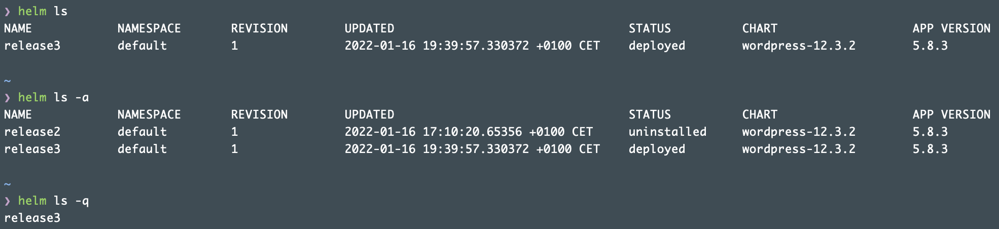
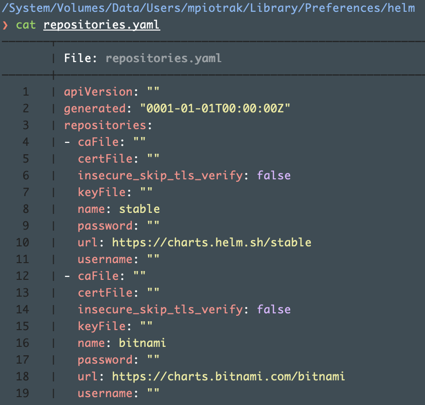

Source:
- https://helm.sh/docs/
- https://app.pluralsight.com/library/courses/kubernetes-packaging-applications-helm/
---

# Table of contents

- [Overview](#paragraph1)
  - [Repository](#paragraph1.1)
- [Commands]
- [Templates]
- [Functions and pipelines]
- [Logical operators/Conditions/Variables/Helpers]
- [Passing values]
- [Subcharts]
- [Hooks]

# Overview

Helm is an open source package manager for Kubernetes graduated from CNCF. It provides the ability to provide, share, and use software built for Kubernetes.

Helm uses a packaging format called charts. A chart is a collection of files that describe a related set of Kubernetes resources. A single chart might be used to deploy something simple, like a memcached pod, or something complex, like a full web app stack with HTTP servers, databases, caches, and so on. Charts are created as files laid out in a particular directory tree. They can be packaged into versioned archives to be deployed.

A chart is organized as a collection of files inside of a directory. The directory name is the name of the chart (without versioning information). Thus, a chart describing WordPress would be stored in a `wordpress/` directory.
Inside of this directory, Helm will expect a structure that matches:

 

For the use of this documentation below naming convention will be used:
- [x] `[chart_name]` - refers to either `[repo/chart_name]` or `./[local_chart_directory]`
- [x] `[name]` - refers to the `release name` (running instance of a chart)

# Repository

Helm repository is a web server representing the content of `index.yaml` file.

`helm repo [command]` - can be used to add, remove, list, and index chart repositories 
&emsp;&emsp;`helm repo list` 
&emsp;&emsp;`helm repo add/remove [repo_name] [repo_url]` 
&emsp;&emsp;`helm repo update` - gets the latest information about charts from the respective chart repositories

`helm search [command]` - searches for charts 
&emsp;&emsp;`helm search repo [keyword]` - searches repositories for a keyword in charts 
&emsp;&emsp;`helm search hub [keyword]` - searches for charts in the Artifact Hub or own hub instance

Once files are locally tested and complete to be released it would be firstly packed using: 
`helm package ./[local_chart_directory]` 
&emsp;&emsp;`helm package ./[local_char_directory] --sign --key [key_name] --keyring [keyring_location} ./[local_chart_directory]` - allows to sign chart package with GPG key and save sha256 sum to [local_package_name.tgz.prov] file

`helm verify [local_package_name.tgz]` - verifies package against information saved in [local_package_name.tgz.prov] file

Then we would need to create index file
`helm repo index [helm_repo_directory]` - creates `index.yaml` file based on packed helms in specified directory. If file already exists it will be updated.

Once this is done we need to publish it to the remote storage and then update local repository information using:
`helm repo index update`

# Commands

`helm [command]` - examplary command syntax 
&emsp;&emsp;`helm [command] --kube-context [context-name]` 
&emsp;&emsp;`helm [command] --kubeconfig`

`helm create [name]`

`helm pull [chartrepo/chart_name]`

`helm fetch [repo/chart_name]` - downloads helm-chart files for revision 
&emsp;&emsp;`helm fetch --untar [repo/chart_name]` - downloads and decompresses

`helm install [name] [chart_name]` - installs a chart archive 
&emsp;&emsp;`helm install [name] [chart_name] --dry-run --debug ----disable-openapi-validation` - `[--dry-run]` simulates installation; `[--debug]` enables verbose output; `[--disable-openapi-validation]` installation process will not validate rendered templates against the Kubernetes API 
&emsp;&emsp;`helm install [name] [chart_name] --version=<specific_version>` 
&emsp;&emsp;`helm install [name] [chart_name] --values=<custom_values.yaml>` - install chart with custom values file (overriding default values.yaml file) 
&emsp;&emsp;`helm install [name] [chart_name] --set image.tag=latest` - installing helm with specific set of values. By default when using `helm create [chart_name]` Helm creates a nginx chart which has a default image tag value of the value inserted in the Charts.yaml file.

`helm uninstall/un/delete/del [name]`
&emsp;&emsp;`helm uninstall $(helm ls -q[quiet])` - q flag will list only release names, without system column names

While running commands like helm install or helm upgrade, the helm client connects to the cluster and stores the record as secrets, i.e release. e.g. sh.helm.release.v1.elastic-operator.v1

`helm status [name]`

`helm template [name] [chart_name] -f [values_file] --validate` - renders chart templates locally and displays the output

> :bulb: `helm template` doesn't complete validation of the output therefore it's best to use it with `[--dry-run]` option for proper results.

`helm show values [chart_name]`

`helm get all [name]` - prints a human readable collection of information about the notes, hooks, supplied values, and generated manifest file of the given release 
`helm get manifest [name]` - takes a release name and prints out all of the Kubernetes resources that were uploaded to the server 
`helm get values [name]` - downloads a values file for a given release

`helm ls` 
&emsp;&emsp;`helm ls --short`

`helm upgrade [name] [chart_name] --recreate-pods` 
&emsp;&emsp;`helm upgrade [name] [chart_name] --install --atomic` - `[--install]` will install chart if not present; `[--atomic]`  will automatically run a helm rollback if upgrade fails

`helm history [revision_number]`

`helm rollback [name] [revision_number]`

`helm dep list` - lists all the required dependencies for inspected helm-chart
`helm dep update` - downloads required dependency if missing

 

> :bulb: dependencies are listed within requirements.yaml file and held within /charts folder

`helm lint ./[local_chart_directory]` - syntax check

`helm version`

> :bulb: Helm in version 2 attempts to show tiller version as well.

`helm env` - lists all the environment variables used by Helm

* File in which all the repositories are listed.

# Templates

---Template structure
Helm templates are based on Go templates.
Directives [ .var ] in template files are placed between curly braces [{{ }}] (“mustache syntax”) and must have blank space after opening {{ and a blank space before closing }}. Upon processing template files, the templating engine (always executed at client’s side) replaces directives with values placed in object files (i.e. values.yaml) resulting in rendering manifest files.
Leading dots are also crucial since values that are passed into a template can be thought of as namespaced objects, where a dot (.) separates each namespaced element. For example .Chart.name can be read as "start at the top namespace, find the Chart object, then look inside of it for an object called name".

NOTE: Spaces have syntax meaning in YAML.
NOTE: Note comments do not help. Template syntax inside comments gets interpreted.

---Template testing
Templates can be tested before installing chart in two ways:
static - using helm template [chart_name] - works offline without contacting Kubernetes API
dynamic - using helm install [name] [chart_name] --dry-run --debug 2>&1 | less - contacts Kubernetes API but does not commit actual changes. [--debug] flag redirects to stderr therefore 2>&1 redirection has been used.

# Functions and pipelines

* Syntax difference between functions and pipelines in applying logic in templates.

---with

with function is a scope restricted function that allows to render a specific section of an object file. By default it adds carriage returns at the beginning and at the end of its invocation.

---range
range function is a scope restricted function.

* Following template first defines a variable $rootDomain := .Values.config.rootDomain and then ranges through a list defined in values.yaml file. Variable had to be declared before loop invocation because the range function can’t reach outside of the scope it processes. Variables can as well invoke child parameters in the following matter: $config := .Values.config and then $config.rootDomain

{{- range $key, $value := .Values }}
  {{ $key }}: {{ $value | toString | quote | b64enc }}
{{- end }}

---include
The file _helpers.tpl is the standard way to define several short template snippets we would like to include in other templates.
Include function includes other templates into our YAML templates.
The file _helpers.tpl is the standard way to define several short template snippets we want to include in other templates.

On the first line we give the template snippet a name. We then refer to this name to include it.
The second line gives "myhelm1.name" a default value: .Chart.Name. If the default value does not exist, "myhelm1.name" gets the value of .Values.nameOverride.
trunc 63 truncates it to 63 characters in length.
trimSuffix "-" makes sure that after truncation string does not end with a [-]

Note: File paths are relative to the chart root directory and you can NOT import files from the templates directory.

{{ include “mychart.fullName” . }} - refers to the “mychart.fullName” directive located in the chart_name/template directory.

---required
The following example of the required function declares an entry for .Values.who is required, and will print an error message when that entry is missing:

---default
This function allows specifying a default value inside of the template, in case the value is omitted.

---indent/nindent
nindent is almost identical to indent, but begins a new line allowing to present code in cleaner and easier to read manner.

---tpl
tpl function evaluates its first argument as a template in the context of its second argument, and returns the rendered result.

---whitespace manipulator [-]

* Example of template rendered without use of whitespace manipulator and with it. Rendering engine removes the contents inside brackets - {{ }} - but the preceding whitespace and the subsequent newline remains, therefore the empty space in the first example was present. Make sure there is a space between the - and the rest of the directive. {{- 3 }} translates to “remove a whitespace to the left and print ‘3’”, while {{-3}} means “print ‘-3’”.

# Logical operators/Conditions/Variables/Helpers

---logical operators
Logical operators are functions followed by two values to be compared, i.e. {{- if eq .value1 .value2 }}

Line 2 and 3 demonstrates how to declare Helm template variables declared in _helpers.tpl file.
Note the hyphens (-) at {{ and }} - those hyphens/dashes eat whitespace characters. {{- eats all whitespaces to the left
-}} means whitespace to the right should be consumed - including the newline - the line is entirely removed.

---conditions
{{- if and .key1 (or .key2 .key3) }} - render content if .key1 exists and .key2 or .key3 exists
{{- if (and (eq .key1 “value1”) (not (empty .key2 ))) }} - render content if .key1 has a value of .value1 and value of .key2 is not empty
{{- if or .key1 (and .key2 (or .key3 .key4 )) }} - render content if .key1 has a true value or .key3 or .key4 for .key2 are true

---variables
Variables are defined before using scope restricted functions since interpolating other object directives (i.e. .Chart.Name,.Release.name [unless prefixed with $ e.g. $.Chart.Name]  or out-of-current scope directive like .Values.defaultPortName }} within with or range functions.

{{ $exampleVariable := .Values.defaultPortName }} - variable assignment syntax

* Example of bypassing scope function with variable.

---helpers
Helper functions (also called sub-templates) are helm code snippets allowing to reuse defined structures (using include function) gathered in _helpers.tpl file. Their names are global therefore it is recommended to prefix them with chart_name so they will not interfere with child charts.

NOTE: Files prefixed with underscore [_] are not rendered by helm engine.
NOTE: Chart of type type: library can be used as storage of helpers for the others chelm_charts. It will not render any template files even if it contains any (usually doesn’t).

# Passing values

The default values file must be named values.yaml to replace their placeholders in the template files. If placed in templates directory it will be rendered automatically otherwise it needs to be referred using the [-f /file/directory] flag.
Template files can also get their values from the user via the --set flag on the install command. Passed value can be in form of array therefore it should be passed as follows - --set foo.subfoo[0].id=bar
To see values passed to helm installation use --dry-run to avoid actual installation.

USER-SUPPLIED VALUES: values passed by implicitly specified custom_values.yaml file (along with [-f] flag) or using --set flag
COMPUTED VALUES: Shows the calculated values from values.yaml This is shown alphabetically while values in file are in random order.

.Values.image.pullPolicy gets the value from:
the values.yaml file
the content of .image.pullPolicy

Child charts can have their values overwritten by the parent chart (not other way around) using nested values as per follows:

Parameters saved in the object file as global will be common for both child and parent charts.

---Built-in template objects
- passing values regarding release

annotation: data.{{ File.Get file_name.txt }} - it is possible to render file content as a value however file can’t be placed in templates directory and its location is relative to the root of the chart

annotation: data.{{ Template.Name }}/{{ Template.BasePath }} - passing values about template itself

annotation: data.{{ Chart.Name }} - in this situation “Name” starts with uppercase even though file Chart.yaml has a parameter “name”.

# Subcharts

Parent chart can explicitly override the values of the subchart by defining the value on its values file.
Global values on the other hand can be accessed by both the parent and any subchart that are present. They are defined using the global keyword.

# Hooks

Chart hooks provide a mechanism to exert control over chart processing.

Hooks characteristics:
defined by annotations
have weight
create stand alone objects (not part of chart release)
can test charts before deploying them (a specific yaml file should be placed in /templates/tests folder) using helm test [chart_name] command

* “something.fullname” would render to “something.service_name”

Hooks types:
pre-install
post-install
pre-delete
post-delete
pre-upgrade
post-upgrade
pre-rollback
post-rollback

# random

Helm functions are used to generate random data, such as passwords, keys, and certificates. Random generation creates new arbitrary values and updates the resources in the cluster with each deployment and upgrade. For example, it can replace your database password in the cluster with every version upgrade. This causes the clients to be unable to connect to the database after the password change.
To address this, it is recommended to randomly generate values and override those already in the cluster. For example:
{{- $rootPasswordValue := (randAlpha 16) | b64enc | quote }}
{{- $secret := (lookup "v1" "Secret" .Release.Namespace "db-keys") }}
{{- if $secret }}
{{- $rootPasswordValue = index $secret.data "root-password" }}
{{- end -}}
apiVersion: v1
kind: Secret
metadata:
  name: db-keys
  namespace: {{ .Release.Namespace }}
type: Opaque
data:
  root-password: {{ $rootPasswordValue}}
The template above first creates a 16-character randAlpha value, then checks the cluster for a secret and its corresponding field. If found, it overrides and reuses the rootPasswordValue as root-password.
