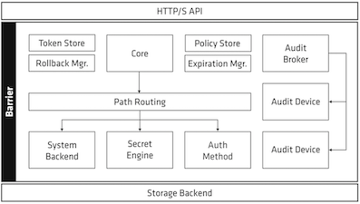
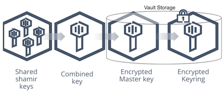

# Table of contents

- [Overview](#paragraph1)
- [Architecture](#paragraph2)
  - [Glossary](#paragraph2.1)
  - [Security model](#paragraph2.2)
    - [Seal/unseal operation](#paragraph2.2.1)
    - [Auto unseal operation](#paragraph2.2.2)
- [General rules](#paragraph3)
- [Authentication](#paragraph4)
  - [Clients](#paragraph4.1)
  - [Tokens](#paragraph4.2)
    - [Root token](#paragraph4.2.1)
    - [Token lifecycle](#paragraph4.2.2)
  - [Policies](#paragraph4.3)
    - [Root and default policies](#paragraph4.3.1)
- [Secrets engines](#paragraph5)
  - [Identity secrets engine](#paragraph5.1)
  - [Cubbyhole secrets engine](#paragraph5.2)
  - [KV secrets engine](#paragraph5.3)
  - [Transit secrets engine](#paragraph5.4)
  - [Response wrapping](#paragraph5.5)
  - [Dynamic secret lifecycle](#paragraph5.6)
- [API structure](#paragraph6)
- [Commands](#paragraph7)
  - [Authentication related commands](#paragraph7.1)
  - [Token related commands](#paragraph7.2)
  - [Policy related commands](#paragraph7.3)
  - [Secrets-engine related commands](#paragraph7.4)
  - [Lease related commands](#paragraph7.5)
- [How-to](#paragraph8)


# Overview <a name="paragraph1"></a>

Vault is an opensource secret lifecycle manager written in Go. Stored secrets can be **static** in nature and stored directly on Vault or **dynamic**, meaning be only managed by Vault. Vault provides a unified interface to any secret, while providing tight access control and recording a detailed audit log.

The key features of Vault are:<br>
- [x] **Secure Secret Storage**- arbitrary key/value secrets can be stored in Vault. Vault encrypts these secrets prior to writing them to persistent storage, so gaining access to the raw storage isn't enough to access your secrets. Vault can write to disk, Consul, and more.
- [x] **Dynamic Secrets** - Vault can generate secrets on-demand for some systems, such as AWS or SQL databases. For example, when an application needs to access an S3 bucket, it asks Vault for credentials, and Vault will generate an AWS keypair with valid permissions on demand. After creating these dynamic secrets, Vault will also automatically revoke them after the lease is up.
- [x] **Data Encryption** - Vault can encrypt and decrypt data without storing it. This allows security teams to define encryption parameters and developers to store encrypted data in a location such as SQL without having to design their own encryption methods.
- [x] **Leasing and Renewal** - all secrets in Vault have a lease associated with them. At the end of the lease, Vault will automatically revoke that secret. Clients are able to renew leases via built-in renew APIs.
- [x] **Revocation** - Vault has built-in support for secret revocation. Vault can revoke not only single secrets, but a tree of secrets, for example all secrets read by a specific user, or all secrets of a particular type. Revocation assists in key rolling as well as locking down systems in the case of an intrusion.


# Architecture <a name="paragraph2"></a>

<p align="center">  </p>

There is a **clear separation** of components that are inside or outside of the security barrier. Only the storage backend and the HTTP API are outside, all other components are inside the barrier.

The storage backend is untrusted and is used to durably store encrypted data. When the Vault server is started, it must be provided with a storage backend so that data is available across restarts. The HTTP API similarly must be started by the Vault server on start so that clients can interact with it.

Once started, the Vault is in a **sealed state**. Before any operation can be performed on the Vault it must be unsealed. This is done by providing the unseal keys. When the Vault is initialized it generates an encryption key which is used to protect all the data. That key is protected by a master key. By default, Vault uses a technique known as Shamir's secret sharing algorithm to split the master key into 5 shares, any 3 of which are required to reconstruct the master key. The number of shares and the minimum threshold required can both be specified. Shamir's technique can be disabled, and the master key used directly for unsealing. Once Vault retrieves the encryption key, it is able to decrypt the data in the storage backend, and enters the unsealed state. Once unsealed, Vault loads all of the configured audit devices, auth methods, and secrets engines. After the Vault is unsealed, requests can be processed from the HTTP API to the Core. The core is used to manage the flow of requests through the system, enforce ACLs, and ensure audit logging is done.

When a client first connects to Vault, it needs to authenticate. Vault provides configurable auth methods providing flexibility in the authentication mechanism used. Human friendly mechanisms such as username/password or GitHub might be used for operators, while applications may use public/private keys or tokens to authenticate. An authentication request flows through core and into an auth method, which determines if the request is valid and returns a list of associated policies.

Policies are just a named ACL rule. For example, the "root" policy is built-in and permits access to all resources. You can create any number of named policies with fine-grained control over paths. Vault operates exclusively in a allowed-access mode, meaning that **unless access is explicitly granted via a policy, the action is not allowed**. Since a user may have multiple policies associated, an action is allowed if any policy permits it. Policies are stored and managed by an internal policy store. This internal store is manipulated through the system backend, which is always mounted at sys/.

Once authentication takes place and an auth method provides a set of applicable policies, a new client token is generated and managed by the token store. This client token is sent back to the client, and is used to make future requests. The client token may have a **lease** associated with it depending on the auth method configuration. Once authenticated, requests are made providing the client token. The token is used to verify the client is authorized and to load the relevant policies. The policies are used to authorize the client request. The request is then routed to the secrets engine, which is processed depending on its type. If the secrets engine returns a secret, the core registers it with the expiration manager and attaches a lease ID. The lease ID is used by clients to renew or revoke their secret. If a client allows the lease to expire, the expiration manager automatically revokes the secret.

The core handles logging of requests and responses to the audit broker, which fans the request out to all the configured audit devices. Outside of the request flow, the core performs certain background activity sucha as lease management which is critical, as it allows expired client tokens or secrets to be revoked automatically. Additionally, Vault handles certain partial failure cases by using write ahead logging with a rollback manager. This is managed transparently within the core and is not user visible.


## Glossary <a name="paragraph2.1"></a>

- [x] **Storage Backend** - responsible for durable storage of encrypted data.
- [x] **Barrier** - cryptographic steel and concrete around the Vault. All data that flows between Vault and the storage backend passes through the barrier. The barrier ensures that only encrypted data is written out, and that data is verified and decrypted on the way in. Much like a bank vault, the barrier must be "unsealed" before anything inside can be accessed.
- [x] **Secrets Engine** - responsible for managing secrets. Simple secrets engines like the "kv" secrets engine simply return the same secret when queried. Some secrets engines support using policies to dynamically generate a secret each time they are queried. This allows for unique secrets to be used which allows Vault to do fine-grained revocation and policy updates.
- [x] **Audit Device** - responsible for managing audit logs. Every request to Vault and response from Vault goes through the configured audit devices. This provides a simple way to integrate Vault with multiple audit logging destinations of different types.
- [x] **Auth Method** - used to authenticate users or applications which are connecting to Vault. Once authenticated, the auth method returns the list of applicable policies which should be applied. Vault takes an authenticated user and returns a client token that can be used for future requests.
- [x] **Client Token** - conceptually similar to a session cookie on a web site. Once a user authenticates, Vault returns a client token which is used for future requests. The token is used by Vault to verify the identity of the client and to enforce the applicable ACL policies.
- [x] **Secret** - term for anything returned by Vault which contains confidential or cryptographic material. Not everything returned by Vault is a secret, for example system configuration, status information, or policies are not considered secrets. Secrets always have an associated lease. This means clients cannot assume that the secret contents can be used indefinitely. Vault will revoke a secret at the end of the lease, and an operator may intervene to revoke the secret before the lease is over. This contract between Vault and its clients is critical, as it allows for changes in keys and policies without manual intervention.
- [x] **Server** - Vault depends on a long-running instance which operates as a server. The Vault server provides an API which clients interact with and manages the interaction between all the secrets engines, ACL enforcement, and secret lease revocation. Having a server based architecture decouples clients from the security keys and policies, enables centralized audit logging and simplifies administration for operators.


## Security model <a name="paragraph2.2"></a>

Due to the nature of Vault and the confidentiality of data it is managing, the Vault security model is very critical. The overall goal of Vault's security model is to provide confidentiality, integrity, availability, accountability, authentication. This means that data at rest and in transit must be secure from eavesdropping or tampering. Clients must be appropriately authenticated and authorized to access data or modify policy. All interactions must be auditable and traced uniquely back to the origin entity. The system must be robust against intentional attempts to bypass any of its access controls.

There is no mutual trust between the Vault client and server. Clients use TLS to verify the identity of the server and to establish a secure communication channel. Servers require that a client provides a client token for every request which is used to identify the client. A client that does not provide their token is only permitted to make login requests.

The storage backends used by Vault are also untrusted by design. Vault uses a security barrier for all requests made to the backend. The security barrier automatically encrypts all data leaving Vault using a 256-bit Advanced Encryption Standard (AES) cipher in the Galois Counter Mode (GCM) with 96-bit nonces. The nonce is randomly generated for every encrypted object. Depending on the backend used, Vault may communicate with the backend over TLS to provide an added layer of security. Because storage backends are untrusted, an eavesdropper would only gain access to encrypted data even if communication with the backend was intercepted.

When a client first authenticates with Vault, an auth method is used to verify the identity of the client and to return a list of associated ACL policies. Vault then generates a client token which is a randomly generated, serialized value and maps it to the policy list. This client token is then returned to the client. On each request a client provides this token. Vault then uses it to check that the token is valid and has not been revoked or expired, and generates an ACL based on the associated policies. Vault uses a strict **default deny** enforcement strategy. This means unless an associated policy allows for a given action, it will be denied. Each policy specifies a level of access granted to a path in Vault. When the policies are merged (if multiple policies are associated with a client), the highest access level permitted is used. Policy is matched using the most specific defined policy, which may be an exact match or the longest-prefix match glob pattern.

Certain operations are only permitted by "root" users, which is a distinguished policy built into Vault. Although clients could be provided with root tokens or associated with the root policy, instead Vault supports the notion of "sudo" privilege. As part of a policy, users may be granted "sudo" privileges to certain paths, so that they can still perform security sensitive operations **without being granted global root access** to Vault.


### Seal/unseal operation <a name="paragraph2.2.1"></a>

When a Vault server is started, it starts in a sealed state. In this state, Vault is configured to know where and how to access the physical storage, but doesn't know how to decrypt any of it. **Unsealing** is the process of obtaining the plaintext master key necessary to read the decryption key to decrypt the data, allowing access to the Vault. Prior to unsealing, almost no operations are possible with Vault. The only possible operations are to unseal the Vault and check the status of the seal.

The data stored by Vault is encrypted and can only be decrypted with the encryption key in which is also stored with the data (in the keyring), but encrypted with another encryption key known as the master key. Therefore, to decrypt the data, Vault must decrypt the encryption key which requires the master key. Unsealing is the process of getting access to this master key. The master key is stored alongside all other Vault data, but is encrypted by yet another mechanism: the unseal key. Summing up: most Vault data is encrypted using the encryption key in the keyring; the keyring is encrypted by the master key; and the master key is encrypted by the unseal key.

<p align="center">  </p>

The default Vault config uses a Shamir seal. Instead of distributing the unseal key as a single key to an operator, Vault uses an algorithm known as Shamir's Secret Sharing to split the key into shards and avoid a risk that a single malicious actor can decrypt the entire Vault. A certain threshold of shards (defaults to 5, any 3 of which must be provided to reconstruct the master key) is required to reconstruct the unseal key, which is then used to decrypt the master key. This is the unseal process: the shards are added one at a time (in any order) until enough shards are present to reconstruct the key and decrypt the master key.

The unseal process is done by running `vault operator unseal` or via the API. This process is stateful: each key can be entered via multiple mechanisms on multiple computers and it will work allowing each shard of the master key to be on a distinct machine for better security.

Once a Vault node is unsealed, it remains unsealed until one of these things happens:
- [x] It is resealed via the API (see below).
- [x] The server is restarted.
- [x] Vault's storage layer encounters an unrecoverable error.

There is also an API to seal the Vault resulting in throwing away the master key in memory and requiring another unseal process to restore it. Sealing only requires a single operator with root privileges. This way, if there is a detected intrusion, the Vault data can be locked quickly to try to minimize damages. It can't be accessed again without access to the master key shards.

:books: [Key rotation - additional documentation](https://www.vaultproject.io/docs/internals/rotation "Key rotation")


### Auto Unseal operation <a name="paragraph2.2.2"></a>

Auto Unseal was developed to aid in reducing the operational complexity of keeping the unseal key secure. This feature delegates the responsibility of securing the unseal key from users to a trusted device or service. At startup Vault will connect to the device or service implementing the seal and ask it to decrypt the master key Vault read from storage.

> :bulb: There are certain operations in Vault besides unsealing that require a quorum of users to perform, e.g. generating a root token. When using a Shamir seal the unseal keys must be provided to authorize these operations. When using Auto Unseal these operations require recovery keys instead. Just as the initialization process with a Shamir seal yields unseal keys, initializing with an Auto Unseal yields recovery keys.

> :warning: Recovery keys cannot decrypt the master key, and thus are not sufficient to unseal Vault if the Auto Unseal mechanism isn't working. They are purely an authorization mechanism.

After sealing Vault will remain sealed until restarted, or the unseal API is used, which with Auto Unseal requires the recovery key fragments instead of the unseal key fragments that would be provided with Shamir.

> :bulb: The seal can be migrated from Shamir Seal to Auto Unseal, Auto Unseal to Shamir Seal, and Auto Unseal to another Auto Unseal.


# General rules <a name="paragraph3"></a>

- [x] Vault is always accessed (no matter if from CLI or UI) through API using one-time-use token granted for each access attempt.
- [x] UI is not enabled by default (unless in dev mode).
- [x] Vault API is the only method to interact with Vault (through UI, CLI or API directly).
- [x] Some of authentication methods are provided by custom plug-ins based on external resources (LDAP, GitHub, AWS IAM, etc.).

`vault <command> <subcommand> [options] [ARGUMENTS]` - example command syntax


# Authentication <a name="paragraph4"></a>

Authentication in Vault is the process by which user or machine supplied information is verified against an internal (i.e. AppRole) or external system (i.e. GitHub, LDAP). Vault supports multiple auth methods each having specific use case. When anything authenticates to Vault, be it a user, application, machine, etc., it is associated with a unique **entity** within the Vault identity system.

**Before a client can interact with Vault, it must authenticate against an auth method**. Upon authentication, a token (conceptually similar to a session ID on a website) associated with that identity is generated for possible future requests. Generated token may have attached policy, which is mapped at authentication time. This token given for authentication with any backend can also be used with the full set of token commands, such as creating new sub-tokens, revoking tokens, and renewing tokens.
Just like secrets, identities (i.e. token) have leases (metadata containing information such as a time duration, renewability etc.) associated with them, meaning that they must reauthenticate after the given lease period to continue accessing Vault. And just like secrets, identities can be renewed without having to completely reauthenticate. All dynamic secrets in Vault are required to have a lease. Even if the data is meant to be valid for eternity, a lease is required to force the consumer to check in routinely.
When renewing the lease (`vault lease renew`), the user can request a specific amount of time they want remaining on the lease (`increment`). This is not an increment at the end of the current TTL; it is an increment from the current time. For example: `vault lease renew -increment=<duration> [lease-id]` would request that the TTL of the lease be adjusted to 1 hour (3600 seconds). Having the increment be rooted at the current time instead of the end of the lease makes it easy for users to reduce the length of leases if they don't actually need credentials for the full possible lease period, allowing those credentials to expire sooner and resources to be cleaned up earlier.

:books: [Lease - additional documentation](https://www.vaultproject.io/docs/concepts/lease "Lease")

CLI tools such as `curl` or `wget` require `X-Vault-Token` header to interact with the API.

Authentication methods types:
  - external:
    - cloud providers - AWS, GCP, Azure
    - cloud native - k8s, GitHub, JWT
    - traditional - LDAP, Kerberos
  - internal:
    - Vault native - Token, Userpass, AppRole

`vault login -method=github token=[token]` - example of authenticating against auth method

All auth methods are **enabled on a path** and can’t be moved on a path once created. If no specific name for auth method is used it will default to auth method's name. All auth methods are mounted to `/sys/auth` path. The same type of auth method can be mounted multiple times at different paths.
Some backends are targeted toward users (interactive) while others are targeted toward machines (programmatic). Most authentication backends must be enabled before use. Only one authentication is required to gain access to Vault, and it is not possible to force a user through multiple auth methods to gain access, although some backends do support MFA.
Disabling an auth method deletes (i.e. revokes tokens) all the information (secrets/configs) stored abouth this method.

`vault auth enable -path=PATH [auth_method]` or `vault write sys/auth/PATH type=[auth_method]` - enabling auth method<br>
&emsp;&emsp;`vault auth enable userpass` - enabling auth method of type `userpass` on path `/sys/auth/userpass`
&emsp;&emsp;`vault auth enable -path=PATH userpass` - enabling auth method of type `userpass` on path `/sys/auth/PATH`

`vault path-help auth/[auth_method]/` - listing endpoint-specific built-in help information

> :bulb: Methods can be tuned (tuning settings are common for all methods) and configured (configuration settings are unique to specific methods).

> :books: [Auth methods - additional documentation](https://www.vaultproject.io/docs/auth "Auth methods")


## Clients <a name="paragraph4.1"></a>

Clients represent anything that has authenticated to Vault, i.e. users who log into the cluster to manage policies, set up dynamic secret rotation as well applications, services, or any other machine-based systems.<br>
Each client is assigned with identity through:
- External Identity Management Platform or SSO - Active Directory, LDAP, OIDC, JWT, GitHub, username/password
- Platform or server-based identities - Kubernetes, AWS, GCP, Azure, PKI, Cloud Foundry
- Self Identity - AppRole, tokens (without an associated auth path or role)


Types of clients:
- human users - GitHub ID, username/password, LDAP, Active Directory, Kerberos, JWT/ OIDC claims, OKTA
- applications or microservices - 2-Factor Authentication methods such as AppRole, or by LDAP, Active Directory, or based on the platform’s identity, such as credentials from AWS, Azure, GCP, AliCloud, OCI, Kubernetes, Cloud Foundry, etc.
- servers and platforms - VMs, Containers, Pods (Identified by LDAP, Active Directory service accounts, AWS, Azure, GCP, AliCloud, OCI, Kubernetes, TLS Certs
- orchestrators - Nomad, Terraform, Ansible, or Continuous Integration Continuous Delivery (CI/CD) Pipelines where each pipeline usually identified by 2FA methods, App Role, or platform based identity
- Vault agents - acting on behalf of a app/microsevice, typically identified by App role, Cloud credentials, Kubernetes, TLS Certs
- tokens - not tied to any identities at all


Anytime user, application, machine, etc. authenticates to Vault it's associated with a unique **entity** within the identity secrets engine. The name reported to the identity systems by the different types of authentication methods varies, each entity is created or verified during authorization. The Vault identity system also provides **entity aliases** - enabling users or services to authenticate with more than one method and are associated with the same policy to share resources and count as unique entities and **identity groups** - logical groupings of entities that can be used to assign policies and metadata.
An entity can have multiple aliases. For example, a single user who has accounts in both GitHub and LDAP, can be mapped to a single entity in Vault that has two aliases, one of type GitHub and one of type LDAP. When a client authenticates via any of the credential backend (except the Token backend), Vault creates a new entity and attaches a new alias to it, if a corresponding entity doesn't already exist. The entity identifier will be tied to the authenticated token. When such tokens are put to use, their entity identifiers are audit logged, marking a trail of actions performed by specific users.


## Tokens <a name="paragraph4.2"></a>

Tokens are the core method for authentication within Vault. They can be used directly or auth methods can be used to dynamically generate tokens based on external identities. **Root token** is the first method of authentication for Vault. It is also the only auth method that cannot be disabled. All external authentication mechanisms, such as GitHub, map down to dynamically created tokens. These tokens have all the same properties as a normal manually created ones.

Within Vault, tokens map to information where the most important one is a set of one or more attached policies. These policies control what the token holder is allowed to do within Vault. Other mapped information includes metadata that can be viewed and is added to the audit log, such as creation time, last renewal time, and more.

Token types:
  - [x] service tokens (default) - support all features, such as renewal, revocation, creating child tokens, and more. They are correspondingly heavyweight (stored in Vault storage backend) to create and track. Leases created by service tokens (including child tokens' leases) are tracked along with the service token and revoked when the token expires. Their id's begin with `s.`
  - [x] batch tokens - encrypted blobs that carry enough information for them to be used for Vault actions, but they require no storage on disk to track them. As a result they are extremely lightweight and scalable, but lack most of the flexibility and features of service tokens - have no accessor, create no child tokens, impossible to renew. Their aim is to support high-volume applications (using high amount of tokens constantly). Leases created by batch tokens are constrained to the remaining TTL of the batch tokens and, if the batch token is not an orphan, are tracked by the parent. They are revoked when the batch token's TTL expires, or when the batch token's parent is revoked (at which point the batch token is also denied access to Vault). Their id's begin with `b.`


The **token auth method is built-in and is at the core of client authentication**. Other auth methods may be used to authenticate a client, but they eventually result in the generation of a client token managed by the token backend.

> :bulb: User performing same authentication steps again will get a new token. Authenticating a second time **does not invalidate the original token**.

Every token has a number of properties:
- [x] `accessor` - can retrieve token properties except ID, check what capabilities it has on certain path and also renew or revoke the token without using itself
- [x] `id` - primary ID of a token is a randomly generated value
- [x] `display_name` - ptionally, a human readable display name
- [x] `metadata` - metadata used for audit logging
- [x] `num_uses` - optionally, a restricted use count
- [x] `parent_id` - optionally, a parent token which created this child token
- [x] `policies` - associated list of ACL policies
- [x] `orphan` - determines whether or not the token has parent token
- [x] `path` - source path (or login path) at which the token was generated (e.g. auth/github/login); used to allow **source based revocation**
- [x] `ttl` - current period of validity since either the token's creation time or last renewal time, whichever is more recent
- [x] `type` - `service` or `batch`


> :warning: The properties of a token are immutable once created. The exception to this is the number of uses (`num_uses`), which is decremented on each request.

If a token is created by another auth method, they do not have a parent token. However, any tokens created by the `auth/token/create` API have a parent token, namely the token used to make that request. By maintaining this **parent-child relationship**, Vault models token trees. Child tokens can be created with a subset of the parent policies, allowing for dropping of privileges. When a token is revoked, the entire sub-tree of tokens is revoked with it. This allows clients to safely generate child tokens and then revoke them all along with the root and ensures that a user cannot escape revocation by simply generating a never-ending tree of child tokens. Often this behavior is not desired, so users with appropriate access can create **orphan tokens**. These tokens have no parent - they are the root of their own token tree.<br>
Tokens can become orphaned in 3 ways:
- [x] explicit creation (token create command)
- [x] tokens created by auth methods
- [x] deliberately orphaned by parent - `vault token revoke -mode=orphan [ACCESSOR | ID]`

Child tokens are very useful, especially when combined with **limited use tokens**. When a token is created, its use count can be optionally specified. Providing a use count of `1` makes it one-time token before being automatically revoked. This can be generalized to any number of uses. Limited use tokens cannot be used to create sub-tokens, but they can be a powerful way to allow extremely limited access to Vault.

When tokens are created, a `token accessor` is also created and returned. This accessor is a value that acts as a reference to a token and can only be used to perform limited actions:
- [x] look up a token's properties (not including the actual token ID)
- [x] look up a token's capabilities on a path
- [x] renew/revoke the token

> :bulb: `id` and `accessor` are the only two attributes that allow to lookup or access information regarding tokens. `accessor` is a convininet way of checking token's capabilites without discovering the token itself (which may be used for rouge actions). Additionally it can be used for auditing purpose where token's `id` wouldn't be preferred to appear.

There are many useful workflows around token accessors. As an example, a service that creates tokens on behalf of another service (such as the Nomad scheduler) can store the accessor correlated with a particular job ID. When the job is complete, the accessor can be used to instantly revoke the token given to the job and all of its leased credentials, limiting the chance that a bad actor will discover and use them.

Audit devices can optionally be set to not obfuscate token accessors in audit logs. This provides a way to quickly revoke tokens in case of an emergency. However, it also means that the audit logs can be used to perform a larger-scale denial of service attack. Finally, the only way to _list tokens_ is via the `auth/token/accessors` command, which actually gives a list of token accessors. While this is still a dangerous endpoint (since listing all of the accessors means that they can then be used to revoke all tokens), it also provides a way to audit and revoke the currently-active set of tokens.

In some cases, having a token revoked would be problematic - for instance, if a long-running service needs to maintain its SQL connection pool over a long period of time. In this scenario, a **periodic token** can be used. At issue time, the TTL of a periodic token will be equal to the configured period. At every renewal time, the TTL will be reset back to this configured period, and as long as the token is successfully renewed within each of these periods of time, it will never expire (however it can have explicit max TTL applied - renewal can’t exceed this value). Outside of root tokens, it is currently the only way for a token in Vault to have an unlimited lifetime.

`vault token create -period=<duration>` - creating periodic token. when renewing periodic token lesser and greater duration values are accepted but not honored, the duration specified at the time of token creation takes precedence

> :warning: Vault requires sudo privileges to create periodic token.

Some tokens are able to be **bound to CIDR(s)** that restrict the range of client IPs allowed to use them. These affect all tokens except for non-expiring root tokens (those with a TTL of zero). If a root token has an expiration, it also is affected by CIDR-binding.

:books: [Tokens - additional documentation](https://www.vaultproject.io/docs/concepts/tokens "Tokens")


### Root tokens <a name="paragraph4.2.1"></a>

Root tokens are tokens that have the root policy attached to them and allowing them to do anything in Vault. In addition, they are the only type of token within Vault that can be set to never expire without any renewal needed. As a result, it is purposefully hard to create root tokens; in fact there are only three ways to create root tokens:
  - [x] initial root token generated at `vault operator init` time (has no expiration)
  - [x] using another root token; a root token with an expiration cannot create a root token that never expires
  - [x] using `vault operator generate-root` with the permission of a quorum of unseal key holders

Root tokens are useful in development but should be extremely carefully guarded in production. In fact, the Vault team recommends that root tokens are only used for just enough initial setup (usually, setting up auth methods and policies necessary to allow administrators to acquire more limited tokens) or in emergencies, and are revoked immediately after they are no longer needed.


### Token lifetime <a name="paragraph4.2.2"></a>

Every non-root token has a **time-to-live (TTL)** associated with it, which is a current period of validity since either the token's creation time or last renewal time, whichever is more recent.

> :bulb: Root tokens may have a TTL associated, but the TTL may also be 0, indicating a token that never expires). After the current TTL is up, the token will no longer function - itself, and its associated leases will be revoked.

If the token is renewable, Vault can be asked to extend the token validity period using `vault token renew` or the appropriate renewal endpoint. At this time, various factors come into play. What happens depends upon whether the token is a periodic token (available for creation by `root/sudo` users, token store roles, or some auth methods), has an explicit maximum TTL attached, or neither.
In the general case, where there is neither a period nor explicit maximum TTL value set on the token, the token's lifetime since it was created will be compared to the maximum TTL. This **effective max TTL** value is dynamically generated and can change from renewal to renewal, so the value cannot be displayed when a token's information is looked up.
It can be defined in number of places where the most specific one takes precedence and overwrites the less specific:
- system wide setting specified within Vault configuration file (default to 32 days)
- mount point setting (can be greater than system max TTL)
- auth method objects (can be set to be greater than mount max TTL but Vault will not honor it) - role, group, user

`vault auth enable -max-lease-ttl=<duration> [auth_method]` - specifies max TTL for auth method (accepts only hours value)<br>
`vault write auth/userpass/user/[user] password=[password] token-max-ttl=<duration>` - `token-max-ttl` has to be lower than system or mount max TTL setting (Vault will allow higher value but will not honor it - it will allow to be set for an object but any attempt of renewing token over the mount max TTL will result in error)

Tokens can also have an **explicit max TTL** set on them. This value becomes a static hard limit on the token's lifetime no matter what the values in _system max TTL_, _max TTL set on a mount_ and a _value suggested by the auth method that issued the token_ dynamic settings are - the token cannot live past this explicitly-set value.  This has an effect even when using periodic tokens to escape the normal TTL mechanism. Explicit max TTL has to be lower than system wide and mount point max TTL setting and can be set explicitly in a `vault token create` command or implicitly through auth method configuration.

> :warning: If no TTL has been set for an object (user, group or role) it will take the value of effective max TTL set for either the auth method of system wide configuration.

:link: [Token related commands](#token-related-commands)


## Policies <a name="paragraph4.3"></a>

Once authenticated, the received token is **assigned with policies** defining the scope of permissions for interaction with Vault. Policies are written in HCL format (JSON compatible) often referred as ACL Policies. There is no way to modify the policies associated with a token once the token has been issued. The token must be revoked and a new one acquired to receive a new set of policies. However, the contents of policies are parsed in real-time whenever the token is used. As a result, if a policy is modified, the modified rules will be in force the next time a token, with that policy attached, is used to make a call to Vault.

A policy defines a list of paths (may specify an exact path to match, or it could specify a glob pattern) where each path expresses the capabilities that are allowed. Capabilities for a path must be granted, as Vault **defaults to denying capabilities to paths** to ensure that it is secure by default.

Policy characteristics:
- [x] can be assigned to multiple entities:
  - [x] directly to a token - `vault token create -policy=[policy]`
  - [x] entity through identity sercrets engine - `vault write auth/userpass/users/[user] token_policies=[policy]`
  - [x] auth method which will grant tokens with policy already assigned to it - `vault write identiy/entity/name[user] policies=[policy]`
- [x] specify allowed, disallowed, and required parameters
- [x] most specific policy takes precedence
- [x] no versioning
- [x] default policy is assigned to new tokens by default, can be edited but not deleted
- [x] root policy has full control, can’t be changed and deleted

<br><br>
Types of capabilities (and associated HTTP verbs):
- [x] create (POST/PUT)
- [x] read (GET)
- [x] update (POST/PUT)
- [x] delete (DELETE)
- [x] list (LIST) - allows to enumerate keys
- [x] deny - disables access to the path and all other granted capabilities
- [x] sudo - grants access to root-protected paths

:books: [Root-protected API endpoints](https://learn.hashicorp.com/tutorials/vault/policies#root-protected-api-endpoints "Root-protected API endpoints")

Policy examples:
- [x] Allows reading `secret/foo` explicitly. An attached token cannot read `secret/bar` or `secret/foo/bar`.
```bash
path "secret/foo" {
  capabilities = ["read"]
}
```
- [x] Allows reading `secret/*`. An attached token could read `secret/foo/zip`, `secret/foo/zip/zap`, but not `secret/foos/zip` or `secret/foo/super-secret` because explicit deny takes precedence.
```bash
path "secret/foo/*" {
  capabilities = ["read"]
}
path "secret/foo/super-secret" {
  capabilities = ["deny"]
}
```

> :bulb: `*` wildcard called **"glob"** is always applied at the end of the path and matches any ANY extension of that path.

- [x] Allows reading the `teamb` path under any top-level path under `secret/`. Specifically usefull to reach the smae key name written into several paths, i.e. `secret/foo/teamb` or `secret/bar/teamb`.
```bash
path "secret/+/teamb" {
  capabilities = ["read"]
}
```

> :bulb: `+` wildcard called "path segment match" is used as a placeholder for a segment within path.

- [x] Allows creating secrets under `secret/foo` path that can only contain `foo` (any value) and `bar` (only one of `zip` or `zap`) key-value pairs. If any keys are specified, all non-specified parameters will be denied. `allowed_parameters` - list of keys and values that are **permitted** on the given path.
```bash
path "secret/foo" {
  capabilities = ["create"]
  allowed_parameters = {
    "foo" = []
    "bar" = ["zip", "zap"]
  }
}
```
- [x] Allows creating secrets under `secret/foo` path with a required parameters named `bar` and `baz`. `required_parameters` - list of parameters that **must** be specified.
```bash
path "secret/foo" {
  capabilities = ["create"]
  required_parameters = ["bar", "baz"]
}
```
- [x] Allows creating secrets under `secret/foo` path, but it cannot have any parameters. `denied_parameters` - blacklists a list of parameter and values. Any values specified here take precedence over `allowed_parameters`. If any parameters are specified, all non-specified parameters are allowed, unless `allowed_parameters` is also set, in which case normal rules apply. The only value that can be used with the `*` parameter is `[]`.
```bash
path "secret/foo" {
  capabilities = ["create"]
  denied_parameters = {
    "*" = []
  }
}
```
- [x] Makes response wrapping mandatory for this path by setting min_wrapping_ttl to `1` second. This also sets this path's wrapped response maximum allowed TTL to `90` seconds.
```bash
path "secret/foo" {
    capabilities = ["create", "update"]
    min_wrapping_ttl = "1s"
    max_wrapping_ttl = "90s"
}
```

:link: [Policy related commands](#policy-related-commands)


### Root and default policies <a name="paragraph4.3.1"></a>

During initialization Vault creates a **root policy** which is capable of performing every operation for all paths. This policy is assigned to the root token that displays when initialization completes. This provides an initial superuser to enable secrets engines, define policies, and configure authentication methods. It is highly recommended to revoke any root tokens before running Vault in production.

Vault also creates a **default policy** which defines a common set of capabilities that enable a token the ability to reflect and manage itself. This policy is also assigned to the root token.

Default policy characteristics allow token to:
- [x] lookup/renew/revoke themselves `auth/token/[lookup-self/renew-self/revoke-self]`
- [x] lookup its own capabilities on a path `[sys/capabilities-self]`
- [x] lookup its own entity by id or name `[identity/entity/id{{identity.entity.id}}]`

`vault read sys/policy/default` - reads default policy
`vault token create -no-default-policy` - creates token without default policy


# Secrets engines <a name="paragraph5"></a>

Secrets engines are components (plugins) which store, generate, or encrypt data within Vault. In terms of their function following characteristics can be listed:
- are provided some set of data, take specific action on that data, and return a result
- store and read data (Redis/Memcached)
- connect to other services and generate dynamic credentials on demand
- provide encryption as a service, totp (Time-based One-time Password) generation, certificates, etc.

Secrets engines are enabled at a path with the name defaulting to their type unless named specifically. When a request comes to Vault, the router automatically routes anything with the route prefix to the secrets engine. In this way, each secrets engine defines its own paths and properties. To the user, secrets engines behave similar to a virtual filesystem, supporting operations like read, write, and delete.
When a secrets engine is disabled, all of its secrets are revoked (if they support it), and all of the data stored for that engine in the physical storage layer is **deleted**.
Moving a secrets engine revokes all secrets, since secret leases are tied to the path they were created at. The configuration data stored for the engine **persists** through the move.
Secrets engines can be tuned in the same manner as auth methods.

> :bulb: Unlike auth methods, secrets engines can be moved on a path however it results in all existing leases to be revoked.

Secrets engines receive a **barrier view** (similar to chroot) to the configured Vault physical storage. This security feature makes sure that a malicious engine cannot access the data from any other engine.

Secrets engines can be divided based on secrets characteristics:
- static - existing data is stored securely and its lifetime is controlled manualy (e.g. KV)
- dynamic - data is gnerated on demand and assigned with lease (how long secret is valid), meaning Vault automatically controls its lifecycle - revokes secret once lease runs out and updates any systems interacting with that secret (e.g. Nomad)


## Identity secrets engine <a name="paragraph5.1"></a>

Identity secrets engine is the built in identity management solution which internally maintains clients recognized by Vault. Each client is internally termed as an entity. Identity store allows operators to manage the entities by setting policies on the entities which add capabilities to the tokens that are tied to entity identifiers. The capabilities granted to tokens via the entities are an addition to the existing capabilities of the token and not a replacement. The capabilities of the token that get inherited from entities are computed dynamically at request time. This provides flexibility in controlling the access of tokens that are already issued.
Identity secrets enigine is enabled by default, can't be disabled or enabled multiple times on different paths.

> :bulb: Identity information is used throughout Vault, but it can also be exported for use by other applications. An authorized user/application can request a token that encapsulates identity information for their associated entity. These tokens are signed JWTs following the OIDC ID token structure. The public keys used to authenticate the tokens are published by Vault on an unauthenticated endpoint following OIDC discovery and JWKS conventions, which should be directly usable by JWT/OIDC libraries. An introspection endpoint is also provided by Vault for token verification.


## Cubbyhole secrets engine <a name="paragraph5.2"></a>

The cubbyhole secrets engine is used to store arbitrary secrets within the configured physical storage for Vault namespaced to a token. In cubbyhole, paths are scoped per token (service token). No token (not even root token) can access another token's cubbyhole. When the token expires, its cubbyhole is destroyed. Also unlike the kv secrets engine, because the cubbyhole's lifetime is linked to that of an authentication token, there is no concept of a TTL or refresh interval for values contained in the token's cubbyhole.
The cubbyhole secrets engine is enabled by default. It cannot be disabled, moved, or enabled multiple times.

> :warning: Writing to a key in the cubbyhole secrets engine will completely replace the old value.


## KV secrets engine <a name="paragraph5.3"></a>

The kv secrets engine is a generic Key-Value store used to store arbitrary secrets within the configured physical storage for Vault. This backend can be run in one of two modes; either it can be configured to store a single value for a key (v1) resulting in reduced storage size for each key since **no additional metadata or history** is stored; or versioning can be enabled (v2) and a configurable number of versions for each key will be stored. In v2 KV backend a key can retain a configurable number of versions defaulting to 10 versions where older versions' metadata and data can be retrieved. Check-and-Set operations can be used to avoid overwriting data unintentionally. When a version is deleted the underlying data is not removed, rather it is marked as deleted. Deleted versions can be undeleted. To permanently remove a version's data the destroy command or API endpoint can be used. Key names must always be strings. If writing non-string values directly via the CLI, they will be converted into strings. However, non-string values can be preserved by writing the key/value pairs to Vault from a JSON file or using the HTTP API. Unlike other secrets engines, the KV secrets engine does not enforce TTLs for expiration. Instead, the `lease_duration` is a hint for how often consumers should check back for a new value. Even with a ttl set, the secrets engine never removes data on its own. The ttl key is merely advisory.
v2 of KV secrets engine is the **default**. v1 can be upgraded to v2 however downgrading from v2 to v1 is not possible.

> :warning: PATH to a secret is also sometimes referred as KEY in regards to KV secrets engine, which can be confusing.


## Transit secrets engine <a name="paragraph5.4"></a>

The transit secrets engine handles cryptographic functions on data in-transit. Vault doesn't store the data sent to the secrets engine, the only stored data are keys for signing. It can also be viewed as _cryptography as a service_ or _encryption as a service_. The transit secrets engine can also **sign and verify data**; generate hashes and HMACs of data; and act as a source of random bytes. The primary use case for transit is to encrypt data from applications while still storing that encrypted data in some primary data store. This relieves the burden of proper encryption/decryption from application developers and pushes the burden onto the operators of Vault.
Key derivation is supported, which allows the same key to be used for multiple purposes by deriving a new key based on a user-supplied context value. In this mode, convergent encryption can optionally be supported, which allows the same input values to produce the same ciphertext.
Datakey generation allows processes to request a high-entropy key of a given bit length be returned to them, encrypted with the named key. Normally this will also return the key in plaintext to allow for immediate use, but this can be disabled to accommodate auditing requirements.

`vault write -f transit/keys/[key]` - creates a named encryption key<br>
`vault write transit/encrypt/[key] plaintext=$(base64 <<< "[secret data]")` - encrypts plaintext using `/encrypt` endpoint

> :warning: All plaintext data must be base64-encoded. Vault does not store any of this data. The caller is responsible for storing the encrypted ciphertext. When the caller wants the plaintext, it must provide the ciphertext back to Vault to decrypt the value. The returned ciphertext starts with `vault:v1:`. The first prefix (vault) identifies that it has been wrapped by Vault. The v1 indicates the key version 1 was used to encrypt the plaintext; therefore, when rotating keys, Vault knows which version to use for decryption. The rest is a base64 concatenation of the initialization vector and ciphertext.

`vault write transit/decrypt/[key] ciphertext=vault:v1:8SDd3WHDOjf7mq69CyCqYjBXAiQQAVZRkFM13ok481zoCmHnSeDX9vyf7w==` - decrypts ciphertext using `/decrypt` endpoint<br>
`vault write -f transit/keys/[key]/rotate` - rotates the underlying encryption key<br>
`vault write transit/rewrap/[new-key] ciphertext=vault:v1:8SDd3WHDOjf7mq69CyCqYjBXAiQQAVZRkFM13ok481zoCmHnSeDX9vyf7w==` - upgrades already-encrypted data to a new key; this process does not reveal the plaintext data


## Response wrapping <a name="paragraph5.5"></a>

In a scenario when a management server would need to pass a configuration stored in Vault to a cluster of worker servers it would have to download the secret from Vault, save it in storage and send it to destination servers. This way the control server also has all the information regarding the secret and becomes a point of attack.
As an alternative a cubbyhole can be created which stores a copy of a secret, then generate a single-use token that can retrieve it. This token would be then passed in wrapped form by management server directly to cluster of servers and then any workers server that would require this secret can access cubbyhole directly. In this scenario the management node has no knowledge of the secret therefore if compromised does not reveal the secret and each of the worker servers has its own token for accessing the secret. Once token is used cubbyhole gets deleted.

`vault [command] -wrap-ttl=<duration> PATH `- requests response wrapping for any command<br>
`vault kv get -wrap-ttl=30m kv/[secret]` - creates single-use wrapped token for specific secret with explicit max TTL (impossible to renew)<br>
`vault unwrap [options] [TOKEN] `- unwrapps issued token with data from specific secret (no need to authenticate to Vault, however unwrapping is done by connecting to it)


## Dynamic secret lifecycle <a name="paragraph5.6"></a>

Similarly to tokens lifetime controlled by TTL parameters leases control lifecycle of dynamic secret either by extending or renewing their lifetime or by revoking the the secret by revoking the lease.
Lease includes a portion of metadata regarding the secret.

> :bulb: Difference between token's TTL parameters and secret's lease parameters are purely based on terminology used. Unlike tokens that have specific set of commands to investigate their metadata, leases have no direct CLI commands and can be inspected using special path - `/sys/lease/lookup`.

Lease properties:
- [x] lease_id
- [x] lease_duration - represents secrets’s TTL (both default and max TTL). can be inherited from system settings, mount point settings or explicit setting applied to an object inside secrets engine (role, group, uset, etc.)
- [x] lease_renewable - set at the object level. Renewal is prolonged based on current time of lease duration not the time of its creation and can't extend secret’s max TTL. Specifying a smaller increment than the original lease_duration value can effectively shorten lease duration.


# API structure <a name="paragraph6"></a>

`$VAULT_ADDR/v1/sys` - API_ ver1/system_info<br>
`$VAULT_ADDR/v1/sys/auth` - API_ver1/system_info/auth_methods - default path for mounting auth methods <br>
`$VAULT_ADDR/v1/sys/auth/tokens/accessors` - path for viewing all accessors which effectively allows to view all issued tokens<br>
`$VAULT_ADDR/v1/sys/host-info`<br>
`$VAULT_ADDR/v1/sys/mounts` - default path for mounting secrets engines<br>

`$VAULT_ADDR/ui` - UI<br>

:books: [API - additional documentation](https://www.vaultproject.io/api-docs "API")


# Commands <a name="paragraph7"></a>

## Authentication related commands <a name="paragraph7.1"></a>

`vault auth <subcommand> [options] [args]` - groups subcommands for interacting with auth methods<br>
&emsp;&emsp;`vault auth list` - lists existing auth methods<br>
&emsp;&emsp;`vault auth enable [options] TYPE` - enables specified auth method<br>
&emsp;&emsp;&emsp;&emsp;`vault auth enable -path=auth_method_path auth_method` - enables specified auth method on a specific path<br>
&emsp;&emsp;`vault auth disable PATH/` - disables specified auth method. since everything in Vault is path-specific when disabling an auth method an exact path needs to be provided, because same auth method can be mounted multiple times on different paths (path_name/). Once disabled all information (secrets/configs) stored by this auth method are also disabled/revoked<br>
&emsp;&emsp;`vault auth tune [options] PATH/`<br>
&emsp;&emsp;`vault auth tune -description=foo path/` - tuning description for auth_method_type mounted on specifiv path
<br><br>
`vault login [options] [AUTH K=V]`- allows for interactive login (defaults to token auth method)<br>
&emsp;&emsp;`vault login -method=userpass username=foo` - allows for interactive login using userpass auth method

> :bulb: `vault login` is used for **interactive** whereas `vault write` for **programmatic methods**.

<br><br>
`vault path-help auth/[auth_method]/` - displays all options for this part of Vault backend (e.g. regarding userpass auth method)<br>
&emsp;&emsp;`vault path-help auth/approle/users` - displays all information about users endpoint which manages users allowed to  authenticate<br>
&emsp;&emsp;`vault path-help auth/approle/` - displays all information on how to use AppRole as an auth method<br>
&emsp;&emsp;`vault path-help auth/approle/login` - displays all information on how to authenticate using AppRole as an auth method (it requires role-id and &emsp;&emsp; secret id data)

> :bulb: `vault path-help auth/approle/users/foo` - adding random string at the end of an endpoint will force path-help to introduce all the options available if this endpoint would exist.

<br><br>
`vault write [options] PATH [DATA K=V]` - allows for programmatic login<br>
&emsp;&emsp;`vault write auth/userpass/users/foo password=bar` - adds user with password for userpass auth method<br>
&emsp;&emsp;`vault write auth/userpass/login/foo password=bar` - authenticates (logs) user `foo` with password `bar` to userpass auth method

:link: [Authenticate to approle using custom role](#how-to)


## Token related commands <a name="paragraph7.2"></a>

`vault token create [options]` - groups subcommands for interacting with tokens<br>
&emsp;&emsp;`vault token create -type=batch -policy=[policy] -ttl=<duration>`<br>
`vault token lookup [options] [ACCESSOR | ID]`<br>
`vault token capabilities TOKEN PATH` - check capabilities assigned for specified PATH<br>
`vault token revoke [options] [ACCESSOR | ID] - [-self]` argument will revoke currently used token<br>
`vault token renew [options] [ACCESSOR | ID] [-increment=<duration>]`


## Policy related commands <a name="paragraph7.3"></a>

`vault policy <subcommand> [options] [args]` - groups subcommands for interacting with policies<br>
&emsp;&emsp;`vault policy list` or `vault read sys/policy` - lists ALL the policies<br>
&emsp;&emsp;`vault policy read [options] [policy]`<br>
&emsp;&emsp;`vault policy delete [options] [policy]`<br>
&emsp;&emsp;`vault policy write [options] [policy] PATH ` - `PATH` argument refers to a local file PATH or stdin<br>
&emsp;&emsp;`vault policy fmt [options] PATH` - formats policy according to HCL guidelines


## Secrets-engines related commands <a name="paragraph7.4"></a>

`vault secrets <subcommand> [options] [args]` - groups subcommands for interacting with secrets engines<br>
&emsp;&emsp;`vault secrets list` - lists all enabled secrets engines<br>
&emsp;&emsp;`vault secrets enable [options] PATH TYPE` - enables specified secrets engine<br>
&emsp;&emsp;&emsp;&emsp;`vault secrets enable -version=1 -path=PATH kv` - enabling kv secret engine v1 on specific path (defaults to `$VAULT_ADDR/v1/sys/mounts/[secrets_engine]`)<br>
&emsp;&emsp;`vault secrets disable [options] PATH`<br>
&emsp;&emsp;`vault secrets tune [options] PATH` - tunes specific secrets engine settings<br>
&emsp;&emsp;`vault secrets move [options] SOURCE DEST`

> :warning: Unlike most of secrets engines responding to `vault read/list/write/delete` commands KV uses `vault kv` subcommand (mostly for v2).

`vault kv <subcommand> [options] [args]` - groups subcommands for interacting with KV secrets engine<br>
&emsp;&emsp;`vault kv put kv/[secret] ttl=30m key=value` - writes data to KV secrets engine; writing key-value to the same key path automatically creates new version of the key<br>
&emsp;&emsp;`vault kv get -version=<integer> kv/[secret]` - reads versioned data from KV secrets engine. if no `-version=<integer>` specified it will return the latest by default<br>
&emsp;&emsp;`vault kv metadata get kv/[secret]` - reads metadata from KV secrets engine<br>
&emsp;&emsp;`vault kv list PATH/` - lists keys from KV secrets engine (PATH defaults to KV secrets engine name - `kv`)<br>
&emsp;&emsp;`vault kv delete -versions=1 kv/[secret]` - soft-deletes versioned key from KV secrets engine<br>
&emsp;&emsp;`vault kv metadata delete kv/[secret]` - deletes all key's metadata from KV secrets engine and effectively deletes key<br>
&emsp;&emsp;`vault kv undelete -versions=1 kv/[secret]` - recovers versioned data from KV secrets engine<br>
&emsp;&emsp;`vault kv destroy -versions=1 kv/[secret]` - permanently deletes versioned key from KV secrets engine

> :warning: When using `vault kv destroy -versions=1 kv/[secret]` the key-value's reference (but not the actual key-value) will still be visible in secret's metadata, therefore to completely remove a secret `vault delete metadata kv/[secret]` would need to be used.

&emsp;&emsp;`vault read kv/config` - reads current config for specific KV secrets engine<br>
&emsp;&emsp;`vault write kv/config max_versions=<integer>` - sets number of versions to keep for each key (defaults to 10)

> :warning: Both `vault kv delete` and `vault kv destroy` use `-versions=<integer>` rather than `-version=<integer>` that can be observed with `vault kv put` command.

`curl -H "X-Vault-Token: [TOKEN]" [VAULT_ADDR]/v1/kv/[data/metadata]/[secret]?version=<integer>` - reads versioned data from KV secrets engine using API call


## Lease related commands <a name="paragraph7.5"></a>

`vault list [options] /sys/leases/lookup/PATH` - looks up active leases for specific PATH<br>
&emsp;&emsp;`vault list [options] /sys/leases/lookup/consul/creds/web/` - looks up active leases for Consul credentials
<br><br>
`vault lease <subcommand> [options] [args]` - groups subcommands for interacting with leases<br>
&emsp;&emsp;`vault lease renew [options] [lease_id]` - renews specific lease<br>
&emsp;&emsp;&emsp;&emsp;`vault lease renew -increment=<duration> consul/creds/web/lease_id` - renews lease for Consul credentials<br>
&emsp;&emsp;`vault lease revoke [options] [lease_id]`- revokes specific lease<br>
&emsp;&emsp;&emsp;&emsp;`vault lease revoke consul/creds/web/lease_id`- revokes lease for Consul credentials<br>
&emsp;&emsp;&emsp;&emsp;`vault lease revoke -prefix consul/creds/web/` - mass revokes all leases for Consul credentials (requires sudo privileges!)
<br><br>
`vault read [options] PATH` - creates lease<br>
&emsp;&emsp;`vault read [options] consul/creds/web` - creates lease for Consul credentials

> :bulb: `[lease_id]` parameter for Consul credentials will contain full PATH to Consul's [secrets_engine]/creds/[role]; e.g. `consul/creds/web/lease_id`.

`vault write [options] /sys/leases/lookup/ lease_id=[lease_id]` - views lease properties<br>
&emsp;&emsp;`vault write [options] /sys/leases/lookup/ lease_id=consul/creds/web/[lease_id]` - views lease properties for Consul credentials


## How-to <a name="paragraph8"></a>

- [x] check list of roles assigned to auth method - `vault list auth/kubernetes-tm-vault/role`
- [x] read information about specific role assigned to specific auth_method - `vault read auth/[auth_method]/role/[role_name]`
- [x] authenticate to approle auth method ("AwesomeCompanyAppRole") using custom role ("webapp") -<br>
&emsp;&emsp;`vault write auth/AwesomeCompanyAppRole/role/webapp role_name="webapp" secret_id_num_uses=1 secret_id_ttl=2h` - creates AppRole role named webapp on the same path name, which allows using generated `secret_id` only once (`secret_id_num_uses=1`) that lasts for 2h (`secret_id_ttl=2h`)<br>
&emsp;&emsp;`vault read auth/AwesomeCompanyAppRole/role/webapp/role-id` - reads AppRole's webapp role `role_id` for authentication<br>
&emsp;&emsp;`vault write -force auth/AwesomeCompanyAppRole/role/webapp/secret-id` - creates `secret_id` for authentication<br>
&emsp;&emsp;`vault write auth/AwesomeCompanyAppRole/login role=[role-id] secret_id=[secret-id]` - obtains login token using two previously retrieved data
- [x] create named role for specific auth method to authorize the service account bearer (pod) with the specific policy - `vault write auth/[auth_method]/role/[role_name] bound_service_account_names=[k8s_sa_name] bound_service_account_namespaces=[k8s_sa_ns] policies=[policy_name] ttl=1h`
- [ ] check roles assigned to current account
- [ ] check policies assigned to particular role
- [ ] grant user capability to create token only once (to not grant time-restrictd access)


---
The `kubernetes auth method` can be used to authenticate with Vault using a **Kubernetes Service Account Token**. This method of authentication makes it easy to introduce a Vault token into a Kubernetes Pod.

`auth/kubernetes` - default path for kubernetes auth method
`auth/kubernetes/login` - default endpoint
`auth/kubernetes/config`- configuration endpoint
